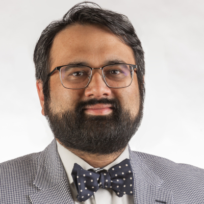

I am currently Interim Head of Informatics at [Quadram Institute Bioscience](https://quadram.ac.uk/). I was previously a Bioinformatics Scientific Programmer with [Andrew Page](https://quadram.ac.uk/people/andrew-page/) at [Quadram Institute Bioscience](https://quadram.ac.uk/). Before that I was a Senior Research Fellow with
[Mark Achtman](https://royalsociety.org/people/mark-achtman-10964/) at the [University of Warwick](https://warwick.ac.uk/fac/sci/med/research/biomedical/labs/machtman/achtmanlab/).

I completed my PhD in 2015, under the supervision of [Scott
Beatson](http://www.aidrc.org.au/scott-beatson) at the [University of
Queensland](http://www.aidrc.org.au/). I graduated from UQ with a
Bachelor of Information Technology and a Bachelor of Science in 2008.

[ORCID: 0000-0002-1243-0767](https://orcid.org/0000-0002-1243-0767) ([Print-friendly version](https://orcid.org/0000-0002-1243-0767/print)).

You may be interested in:

- [My short CV](/cv/).
- [My Projects](/science/).
- [My bioinformatics software](/software/)
- [My publications](/publications/)
- [My GitHub](http://github.com/happykhan)

**Contact me**

- Mastodon: [@happykhan@mstdn.science](https://mstdn.science/@happykhan)
- Twitter: [@happy_khan](https://twitter.com/happy_khan)
- Email: &#110;&#097;&#098;&#105;&#108;&#064;&#104;&#097;&#112;&#112;&#121;&#107;&#104;&#097;&#110;&#046;&#099;&#111;&#109;
- Email: &#110;&#097;&#098;&#105;&#108;&#045;&#102;&#097;&#114;&#101;&#101;&#100;&#046;&#097;&#108;&#105;&#107;&#104;&#097;&#110;&#064;&#113;&#117;&#097;&#100;&#114;&#097;&#109;&#046;&#097;&#099;&#046;&#117;&#107;
- Phone: +44 (0)1603 255000
- Address: Nabil-Fareed Alikhan, Quadram Institute Bioscience, Norwich Research Park, Norwich NR4 7UA, Norfork, United Kingdom

**Photos**

Press photos. e.g. I'm giving a talk and you want to put a photo of me in your seminar notice.

- [Portrait 1](/images/Nabil-FareedAlikhan-port1.jpg)
- [Portrait 2](/images/Nabil-FareedAlikhan-port2bw.jpg)
- [Headshot 1](/images/Nabil-FareedAlikhan-head1.jpg)
- [Headshot 2](/images/Nabil-FareedAlikhan-head2.jpg)
- [Torso 1](/images/Nabil-FareedAlikhan-torso1.jpg)

### Current projects

- [COG UK Consortium](https://www.cogconsortium.uk/about/) National effort for tracking COVID19 (SARSCoV2) through genome sequencing - I contribute analysis and data curation for our data in the Quadram Institute.
- [Building better bioinformatics infrastructure within Quadram Institute](https://www.climb.ac.uk/press-release-from-qib/), moving towards open web platforms and cloud computing - I co-develop and maintain our in-house platforms.
- [The Public Health Alliance for Genomic Epidemiology (PHA4GE)](https://pha4ge.org/) - I contribute to the infrastructure working group, aiming to find consensus in how we deploy Bioinformatics for public health across the world.
- Population genetics and pathogenesis of enteric pathogens, including _Salmonella_ and _E. coli_ - I dabble in research projects, see [my list of publications](/publications) for details
