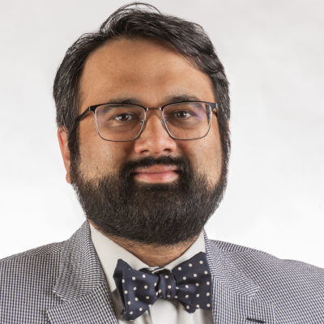

I am [Senior Bioinformatician](https://www.psi.ox.ac.uk/our-team/nabil-fareed-alikhan) at the [Centre for Genomic Pathogen Surveillance, University of Oxford](https://www.pathogensurveillance.net/), working with [David Aanensen](https://www.bdi.ox.ac.uk/Team/david-aanensen). My work is about building tools and platforms that help public health teams and researchers get real answers from pathogen genome data. I led the development of [Pathogenwatch](https://pathogen.watch), a platform now used by 14,389 people in 165 countries to interpret pathogen genomes for surveillance and outbreak response. I also contribute to [AMRwatch](https://amr.watch) and [vaccines.watch], which track antimicrobial resistance and vaccine target diversity from growing collections of public genome data.

Before Oxford, I served as Interim Head of Informatics at [Quadram Institute Bioscience](https://quadram.ac.uk/), where I originally joined as a Bioinformatics Scientific Programmer working with [Andrew Page](https://www.linkedin.com/in/andrewjpage/). During the pandemic I led SARS-CoV-2 surge sequencing at Quadram (September 2021 to April 2022), a programme with over £4.5M project value, contributing to the release of more than 80,000 genomes through COG-UK. Earlier I was a Senior Research Fellow with [Mark Achtman](https://royalsociety.org/people/mark-achtman-10964/) at the [University of Warwick](https://warwick.ac.uk/fac/sci/med/research/biomedical/labs/machtman/achtmanlab/), where I helped build and analyse a collection of 10,000 modern *Salmonella enterica* genomes and integrated ancient metagenomes into [EnteroBase](https://enterobase.warwick.ac.uk/).

My PhD, completed in 2015 under [Scott Beatson](http://www.aidrc.org.au/scott-beatson) at the [University of Queensland](http://www.uq.edu.au/), focused on *Escherichia coli* virulence and genome comparisons. One output from that period, [BRIG](https://sourceforge.net/projects/brig/) (BLAST Ring Image Generator), has since been cited over 3,000 times and remains in active use. I hold dual undergraduate degrees from UQ: a Bachelor of Information Technology and a Bachelor of Science (2008).

My work has 11,687 citations and an h-index of 30. I am a named member of the [UKHSA TARZET Invasive Meningococcal Disease Technical Group](https://www.gov.uk/government/publications/invasive-meningococcal-disease-outbreak-2026-technical-briefings/invasive-meningococcal-disease-outbreak-2026-technical-briefing-1), an editorial board member of [Microbial Genomics](https://www.microbiologyresearch.org/content/journal/mgen), and a member of the [PHA4GE Infrastructure Working Group](https://pha4ge.org/).

[ORCID: 0000-0002-1243-0767](https://orcid.org/0000-0002-1243-0767) ([Print-friendly version](https://orcid.org/0000-0002-1243-0767/print)).

You may be interested in:

- [My CV](/cv/)
- [My science and its impact](/science/)
- [My scrapbook of press and media coverage](/scrapbook/)
- [My bioinformatics software](/software/)
- [My publications](/publications/)
- [My GitHub](http://github.com/happykhan)

**Photos**

If you need an image for a seminar, talk, or event, feel free to use one of the following:

- **[BEST headshot, with white background](/images/Nabil-FareedAlikhan-headshot-whitebg-portrait.jpg). [Square crop version](/images/Nabil-FareedAlikhan-headshot-whitebg-square.jpg).**
- [Headshot with neutral expression](/images/Nabil-FareedAlikhan-neutral-headshot-landscape.jpg). [Square crop version](/images/Nabil-FareedAlikhan-neutral-headshot-square.jpg).
- [Headshot with smile](/images/Nabil-FareedAlikhan-smile-headshot-wide.jpg). [Square crop version](/images/Nabil-FareedAlikhan-smile-headshot-square.jpg).
- [Tech boy with torso](/images/Nabil-FareedAlikhan-techboy-smile-torso-portrait.jpg)
- [Tech boy as headshot, square](/images/Nabil-FareedAlikhan-techboy-headshot-square.jpg)
- [Cafe, Black and white](/images/Nabil-FareedAlikhan-cafe-bw.jpg)
- [Old Headshot with white background, square](/images/Nabil-FareedAlikhan-old-headshot-whitebg-square.jpg)
