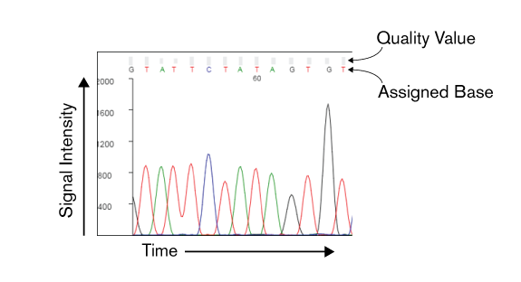

You might have heard that the language of computers is binary (zeros and ones). You may have then wondered why when you using any of your devices there is nary a zero or one in sight. How do these devices that take our words and do anything useful? After all, a computer is a machine and has no understanding of anything.

There is a literal explanation of how your inputs to a computer are handled, which I will not explain here. Conceptually, the key idea is the process of Abstraction.

> In software engineering and computer science, Abstraction is a process to hide details of a system or component that are irrelevant to its usage, to create abstract "models" or "objects" detached from their underlying implementation.

This is not an earth-shattering idea. We make these conceptual models mentally all the time. A common example is driving a car. To use a car to drive around, you do not need to understand the internal mechanics of a combustion engine. There are no cars with a transparent dashboard allowing you to see into the engine all the time. There's no need for this. This could even be distracting. You are able to drive as long as you understand how to use the input interface, like the steering wheel, pedals and gears, and you understand how to use these inputs to get the car to give your desired output. This process of abstraction is useful in other ways, for instance, we do not need to completely re-learn how to drive if we drive different models of cars.

In computing, this process of abstraction has been embraced so whole heartedly that we can comfortable use abstractions without thinking about the underlying mechanics at all. The process of building additional systems on top of others, without fully understanding them, is deeply embedded in computing. The YouTube channel Codexpanse has a [great explanation of Abstraction](https://youtu.be/_y-5nZAbgt4), expanding on what I have mentioned here. If you would like a more concrete example of how a program is executed, the YouTube channel [Computerphile has a concrete example of abstraction using of one the simplest programs](https://youtu.be/ycl1VL0q1rs). They use the example of "Hello world", which is to print something to the screen, and show the number of hidden steps underneath required to produce this result.

# DNA Sequencing as an abstraction

These matters around abstraction are explicit in computer science, but we use models and abstractions all the time. As an example, let's consider DNA (Sanger) sequencing.

DNA sequencing does not directly produce a string of nucleotide characters (ATGC). In the case of Sanger sequencing, the raw measurements are presented in a chromatogram. A chromatogram represents the migration of labeled sequencing products via capillary electrophoresis. Fluorescence is detected at the end of the capillary, and signal intensity from four color channels, each representing a DNA base, is plotted on the y-axis relative to time on the x-axis.

We, aided with software, will take these raw readings and based off the signal intensity make a call on which base is found at each position. Each assigned base will have a quality value (QV), which is a measure of the certainty in that called base. The formula is:

> QV = -10 × log (error probability)

This means that a QV of 20 means that there is a probability of error of 0.01 (1% chance the base is incorrectly called). As the scale is logarithmic, a QV of 10 means that the probability of error is 0.1 (10% chance of error), which is ten times higher than a QV of 20.

Again, you can argue (and many have) that reducing the chromatogram to a single base call and a quality value is not enough information to fully convey the raw data. There are certainly edge cases where this level of abstraction can be misleading. Although, in most cases this is representation is sufficient and sequenced reads are often represented as just as the base call and quality value.

These days, this format of providing a singular base call with measure of quality (usually reflecting confidence) has been adopted by high-throughput sequencing technologies (Illumina, PacBio, Nanopore). This is regardless of the underlying technology used to produce sequencing data. Again, this is an example of abstraction, and is useful as it makes sequencing data from different instruments interoperable (to some extent).
