In this example we will:

- Look at `rnaturalearth`
- Make a choropleth
- Play with projections a bit more.

**Requirements:**

- `R`
- `ggplot2`
- `sf`
- `rnaturalearth`
- `ggrepel`
- `dplyr`
- `ggsflabel`
- `rnaturalearthhires`
- `rnaturalearthdata`

If you have difficulties installing `rnaturalearth` and `sf` natively on your system,
I have found it possible by installing `R` and the packages in a `conda` environment.
I explain [how to do this, here](/posts/conda-install-r).

This post is part of a series about making maps in R:

- [Making a map in R](/posts/making-a-map-in-r)
- [Advanced map making in R](/posts/advanced-map-making-in-r)
- [Variations on map projections in R](/posts/map-projections-in-r)

# Pulling out a specific country/region with rnaturalearth

```r
library("rnaturalearth")
# You also need to install rnaturalearthhires for this to work.
# devtools::install_github("ropensci/rnaturalearthhires")
# devtools::install_github("ropensci/rnaturalearthdata")
au_sf <- ne_states(geounit = "australia",
                   returnclass = "sf")
plot(au_sf)

```

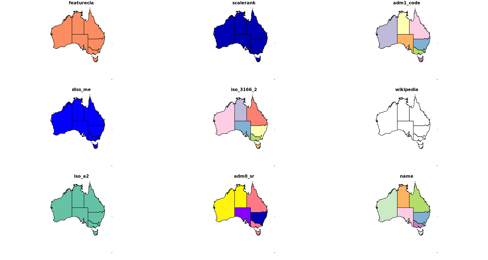

# Some example data to show on our map

I found some numbers for the percentage of people in Australia who live in the capital
for each state. If you didn't know, despite Australia being so big, most people live in
one of the state capitals.

```r
options(repr.plot.width=10, repr.plot.height=6)
states <- c("Australian Capital Territory" ,"New South Wales",
            "Northern Territory", "Queensland", "South Australia", "Tasmania",
            "Victoria", "Western Australia")

pop_in_cap <- c(99.6, 63.0, 54.0, 46.0, 73.5, 41.0, 71.0, 73.4)
df <- data.frame(states, pop_in_cap)
df
# Let's plot it just to see what we are working with.
ggplot(data=df, aes(x=states, y=pop_in_cap, fill=states)) +
    geom_bar(stat="identity") +
    ylab("Population in capital") +
    xlab("State") +
    theme(axis.text.x = element_text(angle = 90, vjust = 0.5, hjust=1))
```

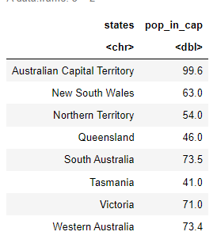

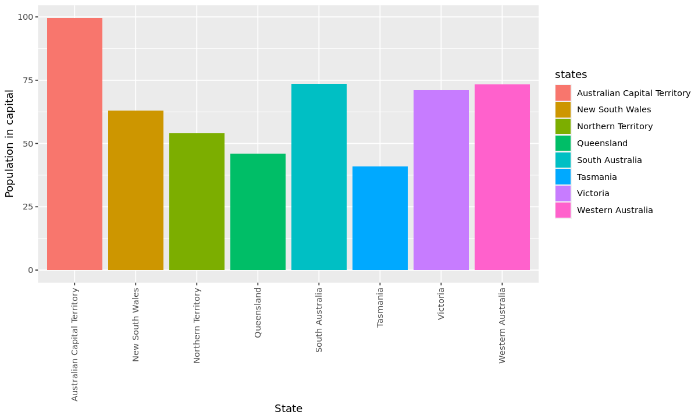

# Chrolopeth map

From Wiki:

> A choropleth map is a type of statistical thematic map that uses intensity of color to
> correspond with an aggregate summary of a geographic characteristic within spatial enumeration units,
> such as population density or per-capita income.

So this is basically, a map with a heatmap. You would have seen these before. One of the ones I've been looking at a lot (because of Covid19) is the [lineage map from Sanger](https://covid19.sanger.ac.uk/lineages/raw)

Let's try to make one with our sample data.

```r
library("ggplot2")
library("rnaturalearth")
library("dplyr")
library(ggrepel)
library(sf)
options(repr.plot.width=15, repr.plot.height=8)
in_sf <- ne_states(geounit = "australia",
                   returnclass = "sf")

in_sf_label <- in_sf  %>% filter(name != "Lord Howe Island", name != "Macquarie Island", name != "Jervis Bay Territory")
# Let's ignore some small regions

in_sf <- in_sf %>% select(name) %>%
  left_join(. , df, by=c("name"="states"))

in_sf$pop_in_cap[ is.na(in_sf$pop_in_cap)] = 0

australia <- ggplot() +
    geom_sf(data = in_sf, aes(fill = pop_in_cap))  +
  geom_label_repel(data = in_sf_label,
                   aes(x=longitude,y = latitude, label = name),
                   size = 3, force = 5, force_pull = 5)
australia
```

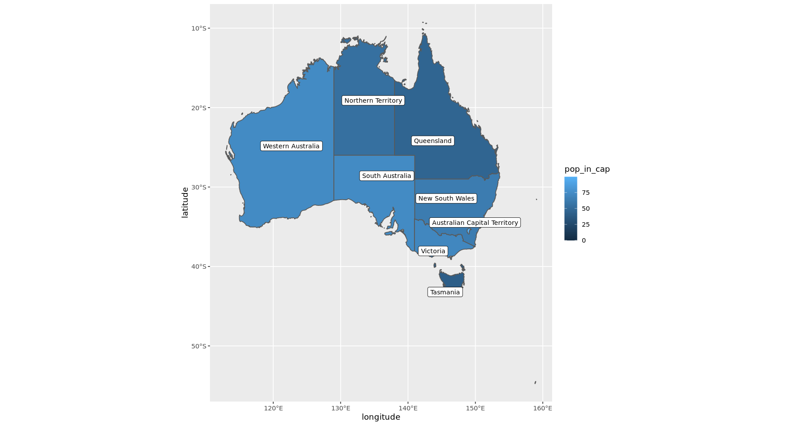

# Map projections in R

[Previously we used the baked in map projections](/posts/making-a-map-in-r) from `ggplot` using `coord_map()`. Now I will try to customise it as we like.
Map projections are intensely complicated, and I frankly have no idea what I am doing.

The trick here is that internally everything we are looking at is just a vector graphic and to add in something like a map projection we need to transform the shapes to fit that projection. In the next few examples I will use `coord_sf()` to take our ggplots and transform them to show a projected map.

## Standardised projections with EPSG

Rather than having to figure out all the settings yourself, people have created templates you can use.
These have been picked to be the best compromise between showing something sensible while being true
to the proportions of the different land masses. It is quite difficult to show something that is
round - like the Earth - on a flat plane.

The one I found to be useful is the EPSG:

> The EPSG is a structured dataset of CRS and
> Coordinate Transformations. It was originally compiled by
> the, now defunct, European Petroleum Survey Group. Here
> are some websites: https://epsg.io/ > http://spatialreference.org/

There are different projections for different regions all over the world. There are many options
depending on which region you want to show, and the type of projection you would like to use.

For Australia, for instance, I found these to be common:

- EPSG:3857 "WGS 84 (ensemble) / Pseudo-Mercator (Web Mercator)" https://epsg.io/3857 - Most common!
- EPSG:3577 "GDA94 / Australian Albers" (My favourite) https://epsg.io/3577
- EPSG:4203 "AGD84" https://epsg.io/4203-1236

Let's see what the difference would be.
This is your standard Mercator (should look like google maps)

```r
australia <-  ggplot() +
    geom_sf(data = in_sf, aes(fill = pop_in_cap)) +
    coord_sf(crs= 3857)
australia
```

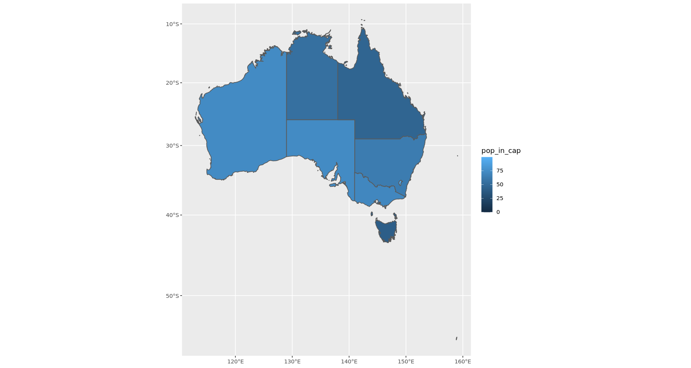

This next one is with a bit curvature, but you can still recognize all the states. I like it.
Can you see the difference to the one above?

```r
australia <-  ggplot() +
    geom_sf(data = in_sf, aes(fill = pop_in_cap)) +
    coord_sf(crs= 3577)
australia
```


This last one is supposed to be a "Geocentric translations (geog2D domain)" centering on Western Australia (right).

```r
australia <-  ggplot() +
    geom_sf(data = in_sf, aes(fill = pop_in_cap)) +
    coord_sf(crs= 8017)
australia
```

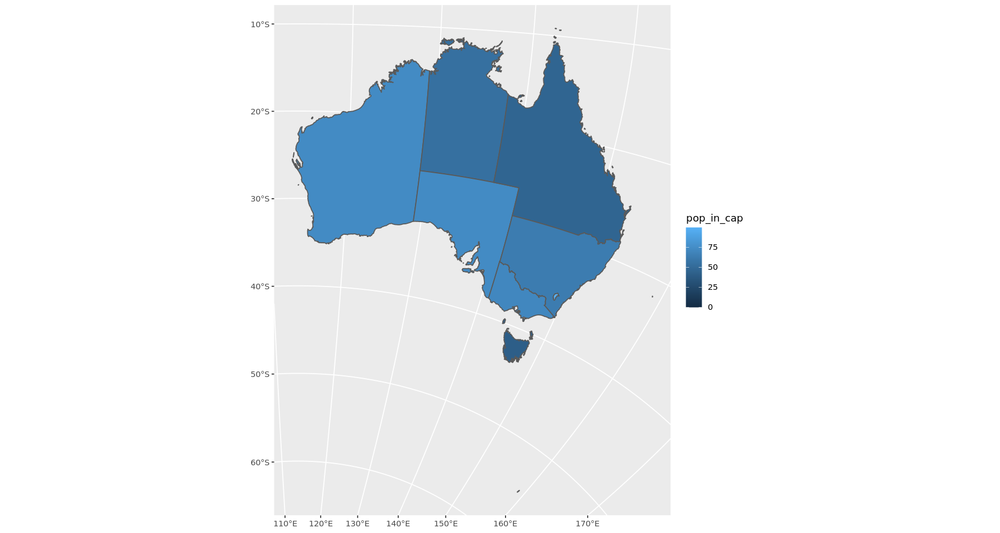

## Custom settings and PROJ

You can fully customise the map and the projection using the "PROJ" strings. https://proj.org/index.html

This is a deep rabbit hole though, and it can get weird. So I would recommend
sticking to the standards above. Let's look at a few custom projections.

```r
australia <-  ggplot() +
    geom_sf(data = in_sf, aes(fill = pop_in_cap)) +
  geom_label_repel(data = in_sf_label,
                   aes(x=longitude,y = latitude, label = name),
                   size = 3, force = 5, force_pull = 5) +
  coord_sf( crs= "+proj=ortho  +lat_0=-30 +lon_0=133")
australia
```

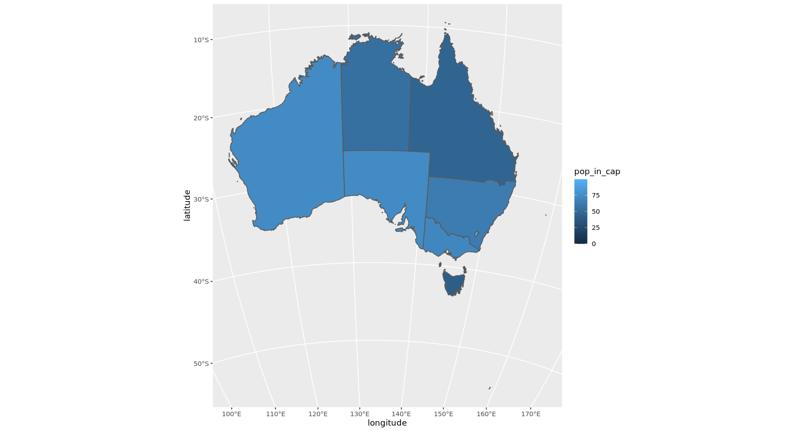

Nothing too special here, orthographic like above and The lat long settings are basically centring on the middle of the nation
Let's look at a another one.

```r
australia <-  ggplot() +
    geom_sf(data = in_sf, aes(fill = pop_in_cap)) +
  coord_sf( crs= "+proj=latlong  +lat_0=-30 +lon_0=133")
australia
```

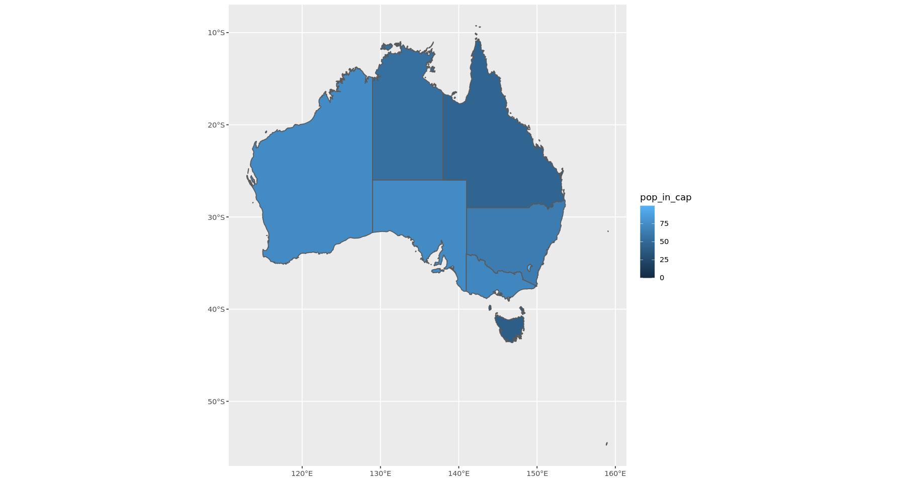

This is the same map like before but it has a normal (flat) conversion of lat and long.
Let's try a strange one.

```r
australia <-  ggplot() +
    geom_sf(data = in_sf, aes(fill = pop_in_cap)) +
  coord_sf( crs= "+init=epsg:3577 +proj=ortho +ellps=GRS80
+datum=GGRS87")
australia
```

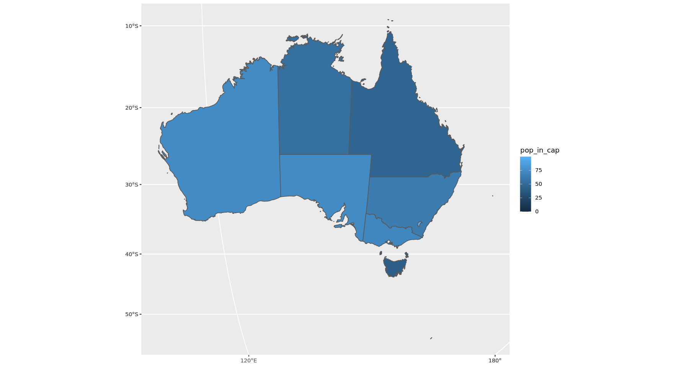

This is _EPSG:3577, orthographic projection and an Ellipsoid specified_

Here are all the parameters you can feed through the proj string

| Param   | Description                                      |
| ------- | ------------------------------------------------ |
| +a      | Semimajor radius of the ellipsoid axis           |
| +b      | Semiminor radius of the ellipsoid axis           |
| +datum  | Datum name                                       |
| +ellps  | Ellipsoid name                                   |
| +lat_0  | Latitude of origin                               |
| +lat_1  | Latitude of first standard parallel              |
| +lat_2  | Latitude of second standard parallel             |
| +lat_ts | Latitude of true scale                           |
| +lon_0  | Central meridian                                 |
| +over   | Allow longitude output outside -180 to 180 range |
| +proj   | Projection name                                  |
| +south  | Denotes southern hemisphere UTM zone             |
| +units  | meters                                           |
| +x_0    | False easting                                    |
| +y_0    | False northing                                   |
| +zone   | UTM zone                                         |

See https://proj.org/index.html for details

# Adding labels and annotations

Let's use the weird map projection from before and try to pin some cities on the map.

It's not clearly explained in a lot of tutorials how to do this. Usually they do not apply any projection - the map is a flat mercator map - and if that is the case you can just feed in the lat/lon as X, Y co-ords and everything works out (like the first map I made).

When we do work with projections, things change. When we specify a set of co-ordinates we also need to specify what projection those co-ordinates are based on. After playing around with it for a while, it seems that is it best to ALWAYS be explicit about the projection settings, which means that when you import or create any set of co-ordinates to put on a map you should also specify the `crs`.

I have rationalised it as such; If I tell you that Brisbane's longitude is 153.0260, what is that in reference to? For instance, where is 0\* in this case? We usually mean Grenwich is 0 but that is not always the case, and when ever we use projections in R all those assumptions are thrown out the window. I will try to illustrate that below:

```r
label_frame <- data.frame("Label" = c("Brisbane", "Perth"), "Lat" = c(-27.4705, -31.9523), "Lon" = c(153.0260, 115.8613))

label_frame <- st_as_sf(x=label_frame, coords = c("Lon", "Lat"), crs = "EPSG:4326")
st_is_longlat(label_frame)

label_frame$geometry

# This is our weird projection from above.
this_crs = "+init=epsg:3577 +proj=ortho +ellps=GRS80
+datum=GGRS87"

st_transform(label_frame, this_crs)

```

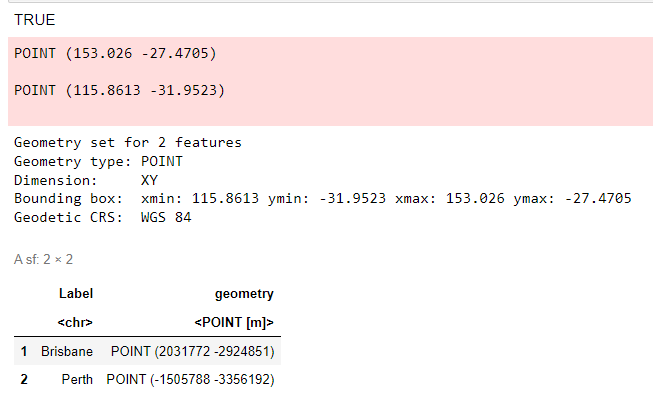

Let us step through it. First, I have created a crude dataframe of two city locations.

The `st_as_sf` takes our raw co-ord numbers and converts it into a geometry point.
This not only has our lat / long info, but also the projection infomation (`crs`).
Because these are _normal_ lat/longs I have used a standard EPSG specification
which is "EPSG:4326, WGS 84 -- WGS84 - World Geodetic System 1984, used in GPS".
A _normal_ map; Grenwich is 0 etc. etc.

To check everything is ok, we can use `st_is_longlat` to check if it is the correct format.
Sometimes if the `crs` is invalid, it will silently fail and keep lon/lat the same,
you then run into problems when you try to plot the values.

If we see what this looks like before we transform, the geometry information is still recognisable as a `normal` lat/long.

We then use `st_transform` to convert the co-ordinates into our weird projection.

When we look at the new co-ords, the x, y coords are now totally different, e.g. Brisbane's co-ords
go from `POINT (153.026 -27.4705)` to `POINT (2031772 -2924851)`.

In practice we don't need to do the `st_transform` ourselves when we are plotting.
`coord_sf` will apply the transformations to every layer in the ggplot. We just need to be careful about
making sure that the data points we give are in the correct format, and have a projection specified. See the example below.

```r
this_crs = "+init=epsg:3577 +proj=ortho +ellps=GRS80+datum=GGRS87"

label_frame <- data.frame(
    "Label" = c("Brisbane", "Perth"),
    "Lat" = c(-27.4705, -31.9523),
    "Lon" = c(153.0260, 115.8613))

label_frame <- st_as_sf(x=label_frame, coords = c("Lon", "Lat"), crs = "EPSG:4326")

australia <-  ggplot(data = in_sf) +
   geom_sf(aes(fill = pop_in_cap)) +
   geom_sf(data = label_frame, size = 6, shape = 23, fill = "darkred") +
   coord_sf(crs=this_crs)
australia
```


Again we create the dataframe and convert it to the correct geometry object - as above.
Then we plot. I am using city co-ords to make red diamonds on the map.
We can pass it through like normal, no need to transform explicitly. `coord_sf` applies to the whole figure.

## So what happens if we do it wrong?

`crs` is required for `st_as_sf`, it will not work otherwise but let's say we give the correct lat long but give a weird `crs`.

```r
this_crs = "+init=epsg:3577 +proj=ortho +ellps=GRS80
+datum=GGRS87"

label_frame <- data.frame("Label" = c("Brisbane", "Perth"), "Lat" = c(-27.4705, -31.9523), "Lon" = c(153.0260, 115.8613))

label_frame <- st_as_sf(x=label_frame, coords = c("Lon", "Lat"), crs = this_crs)

australia <-  ggplot(data = in_sf) +
    geom_sf(aes(fill = pop_in_cap)) +
    geom_sf(data = label_frame, size = 6, shape = 23, fill = "darkred") +
    coord_sf(crs=this_crs)
australia
```

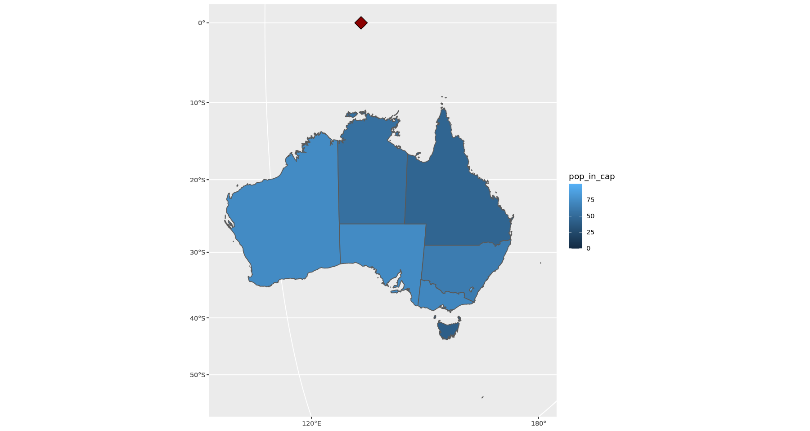

Oops. Let's try this again, without the tranformation step and feeding it to geom_label_repel (exactly like we did in the map at the start).

```r
this_crs = "+init=epsg:3577 +proj=ortho +ellps=GRS80
+datum=GGRS87"

label_frame <- data.frame("Label" = c("Brisbane", "Perth"), "Lat" = c(-27.4705, -31.9523), "Lon" = c(153.0260, 115.8613))

australia <-  ggplot(data = in_sf) +
    geom_sf(aes(fill = pop_in_cap)) +
      geom_label_repel(data = label_frame,
                   aes(x=Lon,y = Lat, label = Label),
                   size = 3, force = 5, force_pull = 5) +
    coord_sf(crs=this_crs)
australia

# The labels repel, but the placement is broken.
```

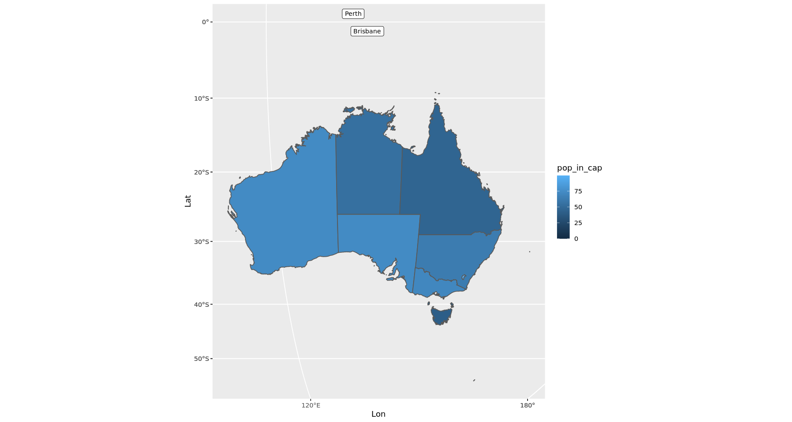

A lot tutorials do not explain the transformation properly. They usually create their data from some other library or resource that has all the correct information baked in, so they often import the map, the data, make the plot and then apply the projection transform to the plot i.e. with `coord_sf` and everything works fine.

Let's do one example where the labels are correct.

```r
this_crs = "+init=epsg:3577 +proj=ortho +ellps=GRS80
+datum=GGRS87"

label_frame <- data.frame("Label" = c("Brisbane", "Perth"), "Lat" = c(-27.4705, -31.9523), "Lon" = c(153.0260, 115.8613))
label_frame <- st_as_sf(x=label_frame, coords = c("Lon", "Lat"), crs = "EPSG:4326")


australia <-  ggplot(data = in_sf) +
    geom_sf(aes(fill = pop_in_cap)) +
    geom_sf_label(data = label_frame, aes(label = Label)) +
    coord_sf(crs=this_crs)
australia
```

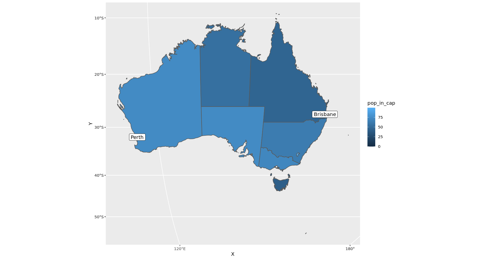

# Adding repl labels

`geom_sf_label` in the example above can be tranformed by `coord_sf`, which is why the labels show up in the correct place. But the labels will not automatically adjust themselves if your figure has many crowded labels. That's why I used `geom_label_repel` at the start - but `geom_label_repel` cant be transformed by `coord_sf`!

So how can we have both the automcatic label adjustment and the projection correction
(without having to calculate all the positioning ourselves)? We have to use something else:
`geom_sf_label_repel` that will give us both features.

The geom_sf_label_repel is in a separate library. Install using `devtools::install_github("yutannihilation/ggsflabel")`

```r
library(ggsflabel)

# The geom_sf_label_repel is in a seperate library
# install using
# devtools::install_github("yutannihilation/ggsflabel")

australia <-  ggplot(data = in_sf) +
    geom_sf(aes(fill = pop_in_cap)) +
    geom_sf(data = label_frame, size = 4, shape = 23, fill = "darkred") +
    geom_sf_label_repel(
        data = label_frame,
        aes(geometry = geometry, label = Label),
        size = 6, force = 5, force_pull = 5) +
    coord_sf(crs=this_crs)
australia
```


