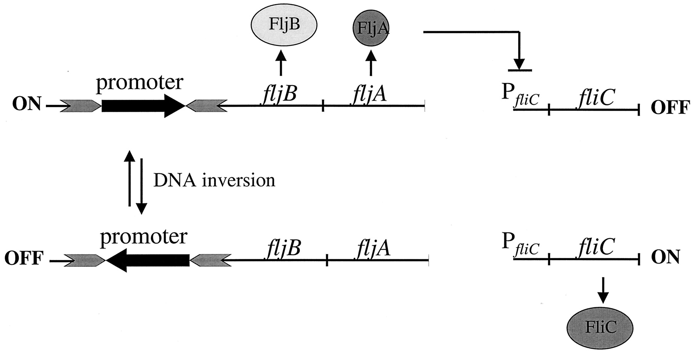

In the post I will describe the basics of *Salmonella* serovar nomenclature. This post will act as a primer for bioinformaticians starting to work with *Salmonella* genomes, who are often at a loss with the complicated nomenclature. 

Serovar designations in *Salmonella* are important, and are the standard molecular method for describing groups within *Salmonella enterica* subspecies *enterica*. Serovar designations are often consistent with sequence based typing and genome spanning phylogenies, see [Achtman 2012 et al.](https://journals.plos.org/plospathogens/article?id=10.1371/journal.ppat.1002776) & [Ashton et al. 2016](https://peerj.com/articles/1752/). Groups defined by *Salmonella* serovar are indeed meaningful and the serovar names - such as **Typhimurium** (Tie-fi-mu-ri-um) or **Chorelasuis** (Ko-re-la-su-iz) - have fanatatic mouth feel when pronounced. These designations will thus persist for the forseeable future.

Serotyping in *Salmonella* is based mainly on surface antigens with biochemical characters, pathogenicity, or habitat being used sometimes to resolve edge cases. There are over 2,500 known profiles. *Salmonella* that are of interest are given a human readable serovar name. Serovars commonly encountered in the literature include Typhi, Typhimurium, Paratyphi A, Paratyphi B, Paratyphi C, Chorelasuis, Infantis, Dublin, Enteritidis, Heidelberg, Javiana, and Newport. 

The serovar with these different names can be treated as distinct groups for the most part. Other *Salmonella* are often mentioned in the literature that do not have a serovar name assigned - these are described with the antigenic formulae, which is complicated string of numbers and symbols that often break scripts that try to read comma delimited files. Remember, all serovars with human readable names, have an underlying antigenic formulae too, for instance the formulae Infantis is 6,7,14:r:1,5. 

## *Salmonella enterica* serovar Typhimurium that are monophasic. 

The only exception to this is typhimurium which is monophasic, this is often described with the antigenic formula only.   Antigenic formula are a complex description but in this case simply remember that  1,4,[5],12:i:- is monophasic Typhimurium. 

> A schematic representation of flagellar phase variation in *S. enterica*. The promoter for the *fljBA* operon is located within an invertible DNA segment whereby inversion of the promoter is mediated by the *Hin* recombinase. In one orientation, the *fljBA* operon is expressed and *FljB* flagellin is produced along with *FljA*, repressor of the unlinked *fliC* gene that encodes *FliC* flagellin. In the opposite orientation, the *fljB* gene is not expressed, nor is the repressor *FljA*, thus allowing transcription of the *fliC* gene. From https://journals.asm.org/doi/10.1128/JB.185.12.3567-3574.2003

# Serovars are somes defined with 

The classic example are the serovars Paratyphi C, Chorelasuis sensu strictu, Chorelasuis var. Kuzendorf, Chorelasuis var. Decatur, Typhisuis. All of these have the same antigenic formulae (6,7:c:1,5). However, have differential abilities e.g. the ability/inability to ferment Dulcitol, H2S or Mucate. Each of these have different host ranges, and form distinct phylogenetic groups. 

# The difference between 'serovar' and 'serotype'
In *Salmonella*, I see these terms being used interchangeably. 
