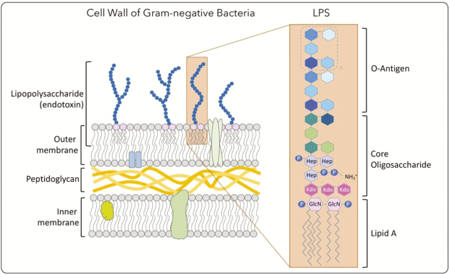

In the post, I will describe the basics of _Salmonella_ serovar nomenclature. This post will act as a primer for bioinformaticians starting to work with _Salmonella_ genomes, who are often at a loss.

Serovar designations by the `White-Kauffman-Le Minor` scheme in _Salmonella_ (also known as the `Kauffman-White` scheme) are a standard method for describing groups within _Salmonella enterica_. Serovar designations are often consistent with sequence based typing and genome spanning phylogenies [(Achtman et al., 2012](https://journals.plos.org/plospathogens/article?id=10.1371/journal.ppat.1002776); [Ashton et al., 2016)](https://peerj.com/articles/1752/). Groups defined by _Salmonella_ serovar are indeed meaningful and the serovar names - such as **Typhimurium** (Tie-fi-mu-ri-um) or **Choleraesuis** (Ko-re-la-su-iz) - have fantastic mouth feel when pronounced. These designations will thus persist for the forseeable future.

Serotyping in _Salmonella_ is based mainly on surface antigens with phenotypic characteristics, which can be tested in the laboratory, being used in certain cases. Information about pathogenicity or niche can also give helpful hints. There are over 2,600 known serotype profiles [(Grimont and Weill, 2007](https://www.pasteur.fr/sites/default/files/veng_0.pdf); [Issenhuth-Jeanjean et al., 2014)](https://doi.org/10.1016/j.resmic.2014.07.004). Serotypes are written as a string of numbers and symbols that often break programming scripts that try to read comma delimited files. '`II 4,12:b:1,5`' is one such example. The formulae do mean something, even though they are not immediately interpretable. For simplicity, you can treat the antigenic formulae as a unique and distinct string identifier. If the entire string is identical, it is the same serovar.

There are bioinformatics software to predict the serotype using a genome assembly (i.e. a FASTA file of contigs). These are two I have used often and recommend:

- [The Salmonella In Silico Typing Resource (SISTR)](https://journals.plos.org/plosone/article?id=10.1371/journal.pone.0147101)
- [SeqSero2](https://pubmed.ncbi.nlm.nih.gov/31540993/)

Both can be run on the command-line, and are available via `conda`. They are also available online at [http://www.denglab.info/SeqSero2](http://www.denglab.info/SeqSero2) and [https://usegalaxy.eu/root?tool_id=sistr_cmd](https://usegalaxy.eu/root?tool_id=sistr_cmd).

## Does the Salmon in _Salmonella_ relate to fish?

No. _Salmonella_ was isolated by Theobald Smith around 1894 while he was looking for the etiological agent of hog cholera, which was a significant problem in the United States at the time. Hence his intial name _Bacillus choleraesuis_. It was later shown that hog cholera was caused by a virus (Classical Swine Fever) and Smith's bacillus was a constant but secondary invader. The genus was later named after Daniel E. Salmon, Theobald Smith's supervisor [(Ryan, O'Dywer and Adley, 2017)](https://www.ncbi.nlm.nih.gov/pmc/articles/PMC5429938/).

_Salmonella_ (Typhi in particular) has been observed beforehand by others, like Karl Eberth and Tadeusz Browicz, and had been cultured before. Georg Gaffky was the first to obtain a pure culture of the "typhoid bacillus", and in 1884 established that it is the causative agent [(Gaffky, 1884)](https://books.google.co.uk/books?id=Y6lQAAAAYAAJ&pg=PA372&redir_esc=y#v=onepage&q&f=false). The bacteria he cultured we know as _Salmonella enterica_ subspecies _enterica_ serovar Typhi. If history has been a little different, _Salmonella_ could be known today as _Eberthella_ or Gaffky-Eberth bacillus.

## Why do serovars have names like 'Typhimurium'?

Many _Salmonella_ serovars have a specific name as well as the serotype. This is in contrast to other organisms like _Escherichia coli_ (e.g. O157:H7 is simply that). The naming system has evolved with our understanding of the organism. Each serotype of _Salmonella_ was originally believed to be a separate species and were given descriptive names, usually describing host specificity or the type of disease [(Ryan, O'Dywer and Adley, 2017)](https://www.ncbi.nlm.nih.gov/pmc/articles/PMC5429938/). As it became clear that the given names were not always correct, the convention changed to name new serovars after the country or city of isolation [(Carpenter, 1968)](https://doi.org/10.1099/00207713-18-3-191). In 1966, perhaps because there were too many serotypes to name, the International Enterobacteriaceae Subcommittee formally rescinded serovar names for serovars belonging to subspecies other than _S. enterica_ subspecies _enterica_ (although at the time subspecies _enterica_ was called **subgenus** _enterica_) [(Carpenter, 1968)](https://doi.org/10.1099/00207713-18-3-191). Finally in 1987, Le Minor and Popoff noted that studies using DNA-DNA hybridisation and other methods showed that _Salmonella_ was comprised of only two species, and that these and the subspecies within were not consistent with serotype. Practically speaking, the growing number of serovars (2,100 at the time) made the one-serovar-one-species concept -- 'untenable' [(Le Minor and Popoff, 1987)](https://doi.org/10.1099/00207713-37-4-465). By this point, however, the names were firmly embedded in the literature and remain in use to this day. Serovars commonly encountered in the literature include Typhi, Typhimurium, Paratyphi A, Paratyphi B, Paratyphi C, Chorelasuis, Infantis, Dublin, Enteritidis, Heidelberg, Javiana, and Newport. All serovars with specific names have an underlying antigenic formulae, for instance, the antigenic formulae for Infantis is `I 6,7,14:r:1,5`.

The table below has some examples of the origins of different serovar names to illustrate the historical and cultural influences on the naming conventions used over time.

| Serovar name | Origin and meaning                                                                           |
| ------------ | -------------------------------------------------------------------------------------------- |
| Agama        | Isolated from the feces of the Agama lizard (_Agama agama_).                                 |
| Agona        | Isolated from cattle in Ghana, presumably in the town Agona, in 1952.                        |
| Anatum       | Isolated from a duck in 1922 in the USA. Epizootic at the time.                              |
| Choleraesuis | Lit. "Swine cholera", believed to be causive agent of Hog cholera. Later found to be untrue. |
| Dublin       | First isolated from the stool of a patient in Dublin, Ireland in 1929.                       |
| Gallinarum   | Causative agent of fowl typhoid.                                                             |
| Heidelberg   | First isolated from a patient in Heidelberg, Germany in 1933.                                |
| Infantis     | First isolated from an infant in Connecticut, USA in 1943.                                   |
| Typhi        | Causes typhoid fever in humans.                                                              |
| Typhimurium  | Lit. "mouse typhi" . Causes typhoid fever in mice.                                           |

## What are the 'O' antigens and 'serogroups'?

O antigen (O polysaccharide) is a part of the lipopolysaccharide (LPS) component of the outer membrane found in all _Enterobacteriacae_. It is a highly variable cell constituent, making it a discriminant marker. It consists of oligosaccharide repeats ('O' units), normally containing two to eight sugar residues. The variation is mostly in the types of sugars present, their order in the structure, and the linkages between them. There are 46 O serogroups in described in the `White-Kauffman-Le Minor` scheme, these used to be denoted by letters of the alphabet but they ran out of letters, and the number of the characteristic O factor are now used instead [(Liu et al. 2014)](https://doi.org/10.1111/1574-6976.12034). The letter definitions are still propagated in the literature. For example, Infantis (`I 6,7,14:r:1,5`) is serogroup O:7 (or C1 using the letter defintions). [Wikipedia](https://en.wikipedia.org/wiki/Kauffman%E2%80%93White_classification) has a simple table of the serogroups and some of their members. [Grimont and Weill (2007)](https://www.pasteur.fr/sites/default/files/veng_0.pdf) is a more detailed catalog. Genetic variation within the O-antigene cluster (between _gnd_ and _galF_), genetic variation of other associated genes encoded on mobile genetic elements, and side chains of the lipopolysaccharide have been used to further divide members of different serogroups [(Liu et al. 2014)](https://doi.org/10.1111/1574-6976.12034).



> Gram-negative bacterial cell-wall structure with emphasis in the lipopolysaccharide (LPS) presence in the outer membrane. From [Monteiro & Faciola (2020)](https://www.ncbi.nlm.nih.gov/pmc/articles/PMC7455920/).

## The 'H' antigen and phase variation in _Salmonella_

H antigens are found in the bacterial flagella and are usually involved in the activation of host immune responses. There are over 114 H antigens described in the `White-Kauffman-Le Minor` scheme.

Many _Salmonella_ have two genes encoding flagella, and these are alternatively expressed (through a process called `phase variation`). The alternation is controlled by inverting a 800-base-pair sequence of DNA. This acts like a switch to turn an encoded promotor on or off. When the promoter is off, the _fliC_ gene, found elsewhere in the genome, is expressed and specifies one specific flagellum. When the promotor is on, the _fljB_ gene that is immediately downstream of the promoter and encodes a different flagellum is expresed instead. At the same time, there is also a transcriptional repressor (_fljA_) expressed, which represses _fliC_ and makes expression of the two flagella encoding genes mutually exclusive. See the diagram below and [Silverman, Hillmen, and Simon (1979)](https://www.ncbi.nlm.nih.gov/pmc/articles/PMC382945/). _Salmonella_ are thus either 'biphasic', 'monophasic' or 'non-motile', with the capability of expressing two, one or no flagella, respectively. The typing results of both flagella are included as part of the antigenic formulae. When serotyping in the lab, specific growth conditions are used to coerce _Salmonella_ to choose one phase or the other.


> A schematic representation of flagellar phase variation in _S. enterica_. The promoter for the _fljBA_ operon is located within an invertible DNA segment whereby inversion of the promoter is mediated by the _Hin_ recombinase. In one orientation, the _fljBA_ operon is expressed and FljB flagellin is produced along with FljA, repressor of the unlinked _fliC_ gene that encodes FliC flagellin. In the opposite orientation, the _fljB_ gene is not expressed, nor is the repressor FljA, thus allowing transcription of the _fliC_ gene. From [Bonifield and Hughes (2003)](https://journals.asm.org/doi/10.1128/JB.185.12.3567-3574.2003)

## Not all serovars are defined strictly by surface antigens (O & H)

Serovar specification is not strictly limited to surface antigens ('O' and 'H'). Other antigens (e.g. Vi) are also used on occasion and other unrelated features can be used as well. An example of this are the serovars Paratyphi C, Chorelasuis _sensu stricto_, Chorelasuis var. Kuzendorf, Chorelasuis var. Decatur, and Typhisuis. All of these have the same antigenic formulae (`I 6,7:c:1,5`). However, have differential abilities e.g. the ability/inability to ferment Dulcitol, H2S or Mucate. Each of these have different host ranges, and form distinct phylogenetic groups [(Zhou et al. 2018)](https://doi.org/10.1016/j.cub.2018.05.058). There are more exceptions, for instance, Gallinarum lacks flagella, thus has no 'H' antigen (the formulae is `1,9,12:–:–`) and is differentiated from its biovar Pullorum biochemically [(Grimont and Weill, 2007)](https://www.pasteur.fr/sites/default/files/veng_0.pdf).

## Is it 'serovar' or 'serotype'?

The terms 'serovars' and 'serotypes' are interchangeable. The World Health Organisation (WHO)/Institut Pasteur use the term 'serovar' [(Grimont and Weill, 2007)](https://www.pasteur.fr/sites/default/files/veng_0.pdf). While the US Centers for Disease Control and Prevention uses the word 'serotype' [(Brenner et al. 2000)](https://www.ncbi.nlm.nih.gov/pmc/articles/PMC86943/). Serovar seems to be the historic term but serotype is the term used in the study of other organisms.

## _Salmonella_ taxonomy today

The `White-Kauffman-Le Minor` scheme recognises two species within the genus _Salmonella_; _S. enterica_ and _S. bongori_. Within _S. enterica_, the scheme recognises six subspecies [(Grimont and Weill, 2007)](https://www.pasteur.fr/sites/default/files/veng_0.pdf). So _Salmonella_ looks like this:

- _Salmonella enterica_
  - _S. enterica_ subsp. _enterica_
  - _S. enterica_ subsp. _salamae_
  - _S. enterica_ subsp. _arizonae_
  - _S. enterica_ subsp. _diarizonae_
  - _S. enterica_ subsp. _houtenae_
  - _S. enterica_ subsp. _indica_
- _Salmonella bongori_

This does make some of the names very long, for instance, serovar Heidelberg would be _Salmonella enterica_ subsp. _enterica_ ser. Heidelberg.
There are shorthand abbreviations for each of the subspecies, used in antigenic formulae.

| Salmonella subspecies             | Abbreviation |
| --------------------------------- | ------------ |
| _S. enterica_ subsp. _enterica_   | `I`          |
| _S. enterica_ subsp. _salamae_    | `II`         |
| _S. enterica_ subsp. _arizonae_   | `IIIa`       |
| _S. enterica_ subsp. _diarizonae_ | `IIIb`       |
| _S. enterica_ subsp. _houtenae_   | `IV`         |
| _S. enterica_ subsp. _indica_     | `VI`         |

_S. bongori_ used to be classed as _S. enterica_ subspecies _bongori_ and used the abbreviation '`V`' but has been since been promoted, which is why '`V`' does not appear in the table above. There are likely other subspecies beyond what is described in the `White-Kauffman-Le Minor` scheme ([Alikhan et al. 2018](https://doi.org/10.1371/journal.pgen.1007261); [Criscuolo et al. 2019](https://doi.org/10.1099/mgen.0.000284)).

## What do the antigenic formulae actually mean?

At first glance it makes no sense:

> `I 6,7,14:r:1,5`

First is the subspecies abbreviation (`I, II, IIIa`...) according to the table above, and then followed by a colon separated list of 3 (maybe 4) individual lists, in the format of:

> O antigen results **:** flagellar (H1) results **:** flagellar (H2) results **:** Other results (maybe)

If the subspecies abbreviation is missing, then it is implied that strain belongs to subspecies _enterica_ (`I`). For instance, Infantis is sometimes written as simply '`6,7,14:r:1,5`'. This can be misleading as the same antigenic profile can be found in multiple subspecies. The nomenclature system at the US Centers for Disease Control and Prevention includes the subspecies abbreviation (`I, II, IIIa`...) in serotypes [(Brenner et al., 2000)](https://www.ncbi.nlm.nih.gov/pmc/articles/PMC86943/).

Each value in the respective sublists is a positive result for different antisera. So in the example above (for Infantis) it means:

| Infantis is: `I` 6,7,14:r:1,5      |
| ---------------------------------- |
| Subspecies _enterica_ (`I`)        |
| Serogroup O:7                      |
| Postive for O antigens 6,7, and 14 |
| Postive for H1 antigens r          |
| Postive for H2 antigens 1 and 5    |

The numbers between lists are not related. So '1' being postive for O antigen has nothing to do with H2 being postive for '1'. A positive in this case is observing agglutination when tested. Each value in the list refers to a pre-defined antiserum. If you are curious about what agglutination looks like, there is [a video here](https://www.youtube.com/watch?v=WsCc5JVU98g). The UKSHA's laboratory process for identifying _Salmonella_ is described [here](https://bfff.co.uk/wp-content/uploads/2014/12/3.National_SOP_FNES16_F13_Detection_of_Salmonella_Species.pdf), and [here](https://assets.publishing.service.gov.uk/government/uploads/system/uploads/attachment_data/file/969498/ID_24i4.pdf).

There are additional symbols used as well, which makes things more complicated. For instance, the { } means that the antigens are mutually exclusive. Let's take serovar Huvudsta, which is 3,{10}{15,34}:b:1,7 as an example.

| Huvudsta is: `I` 3,{10}{15,34}:b:1,7 |
| ------------------------------------ |
| Subspecies _enterica_ (`I`)          |
| Serogroup O:3,10                     |
| Postive for O antigens 3,10 OR       |
| Postive for O antigens 3,15,and 34   |
| Postive for H1 antigens b            |
| Postive for H2 antigens 1 and 7      |

Other symbols include [ ], which means that O or H factor in question may be present or absent. If the O factor is underlined, it means they are present only if the culture is lysogenized by the corresponding converting phage. When H factors
are in square brackets, this means that they are exceptionally found in wild strains. And finally ( ) means that O or H factor in question is only weakly agglutinable. All in all, it should feel quite similar to regular expressions, if you are familiar with those. When the strain is monophasic, a '`-`' is used to denote the absence of a particular flagellum. Non-motile strains have `-` for both H1 and H2.

Here are some antigenic formulae for different serovars, which should now look more friendly.

| Serovar  | Antigenic formulae |
| -------- | ------------------ |
| Norwich  | `I 6,7:e,h:1,6`    |
| Brisbane | `I 28:z:e,n,z15`   |
| Ipswich  | `I 41:z4,z24:1,5`  |
| Seattle  | `I 28:a:e,n,x`     |

If you would like to learn more, you can read the bible of _Salmonella_ serovars, Grimont and Weill's [Antigenic Formulae of the Salmonella Serovars (2007)](https://www.pasteur.fr/sites/default/files/veng_0.pdf). Have a look and see if your hometown has a serovar named after it!

## What is '`I 1,4,[5],12:i:-`'?

The antigenic formulae for monophasic variants of _Salmonella enterica_ serovar Typhimurium is `I 1,4,[5],12:i:-`. It seems to be regularly encountered by bioinformaticians, and I am often asked about this serotype in particular. You may see the shorthand, `I 4:i:-`, used by US Centers for Disease Control and Prevention. When the strain is monophasic, a '`-`' is used to denote the absence of a particular flagellum. Many serovars are entirely monophasic, such as (`1,9,12[Vi]:g,p:–`) and Enteritidis (`1,9,12:g,m:–`)[(Grimont and Weill, 2007)](https://www.pasteur.fr/sites/default/files/veng_0.pdf).

All `I 1,4,[5],12:i:-` are not monophasic Typhimurium, however, there are a number of serotypes that start with `I 1,4,[5],12:i:...` differing only by H2. When H2 is dropped, the monophasic variants will have the same antigenic formulae. As such, if you see the antigenic formulae `I 1,4,[5],12:i:-` you need other information (such as MLST, where many monophasic Typhimurium are ST34) to determine whether it is Typhimurium or not.

These are the serovars that could collide as `I 1,4,[5],12:i:-` [from Grimont and Weill (2007)](https://www.pasteur.fr/sites/default/files/veng_0.pdf):

| Serovar name | Serogroup | O            | H1  | H2      |
| ------------ | --------- | ------------ | --- | ------- |
| Typhimurium  | O4        | _1_,4,[5],12 | i   | 1,2     |
| Lagos        | O4        | _1_,4,[5],12 | i   | 1,5     |
| Agama        | O4        | 4,12         | i   | 1,6     |
| Farsta       | O4        | 4,12         | i   | e,n,x   |
| Tsevie       | O4        | _1_,4,12     | i   | e,n,z15 |
| Tumodi       | O4        | _1_,4,12     | i   | z6      |

> N.B. O antigens `4,12` are the definitive factors for the examples from serogroup O4. The _1_ is only present when lysogenized by the corresponding converting phage (in the lab), and the [5] means the factor may or may not be there. With this in mind, replacing H2 with '`-`' would make all serotypes above indistinguishable when tested.

I searched [EnteroBase](https://enterobase.warwick.ac.uk) for existing genomes that would fit this case. I looked at genomes with the MLST ST associated with each serovar, and then looked at the serotype prediction from [SISTR](https://github.com/phac-nml/sistr_cmd) for cases where `I 1,4,[5],12:i:-` is reported. I found 16 Agama (eBG 167) and 1 Lagos (ST 2469). Many of these were listed with a clinical/human source.

Strains of _Salmonella enterica_ serovar Typhimurium that lack the first phase are also monophasic variants, having the antigenic formulae `I 1,4,[5],12:-:1,2` [(Bugarel et al., 2012)](https://doi.org/10.1016/j.foodres.2011.06.057). Again, these would collide with other serovars such as Saintpaul (`I 1,4,[5],12:e,h:1,2`) and Stanley (`I 1,4,[5],12,[27]:d:1,2`). Naturally, a non-motile Typhimurium has the same antigenic profile as a non-motile strain from almost any other serovar in the O4 serogroup.

## Why is this so complicated?

The simple serovar names (e.g. Typhi) belies the complex discussion of the _Salmonella_ genus. In my opinion, the `White-Kauffman-Le Minor` scheme attempts to simultaneously solve problems around taxonomy, clinical identification, characterising pathogen potential, and provide a stable nomenclature. Admirable? Yes. Foolhardy? Maybe. For instance, serotypes were expected initially to define species. Later, serogroups reflected a neighbourhood of _Salmonella_. And differences in antigenic formula were thought to imply differences in host association and pathogenicity. The scheme goes well beyond giving stable names, measuring genetic variation (like counting SNP differences) or defining flat clonal complexes (like MLST).

Indeed, it is better to consider the `White-Kauffman-Le Minor` scheme as an addressing system for _Salmonella_ rather than just flat names. The scheme is hand and hand with our understanding of _Salmonella_. Many of the address fields we use for _Salmonella_ were defined by the scheme. Hence, if you received a letter from a _Salmonella_, the return address might read:

```mail
RTN TO:
Ser. Heidelberg
c/o 1,4,[5],12:r:1,2
subsp. enterica (I)
enterica
SALMONELLA
```


> **'Wish you were here**,' An AI (Midjourney) generated picture with the prompt; '_Salmonella_ on holiday, postcard'.
