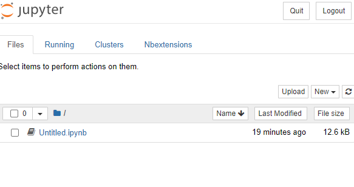
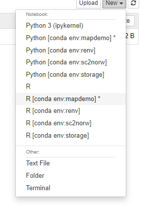
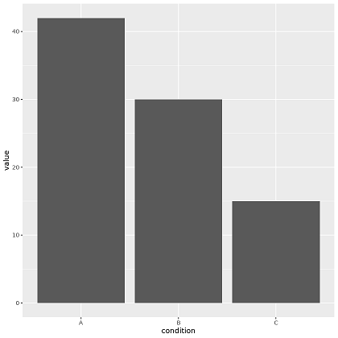

Installing and controlling R and jupyter notebooks through conda is a much easier than installing it natively.
I give a full explanation at the end as to why I do this way, but here's the method to start with.

You can naturally change the name of the conda env (I used `mapdemo` here) to anything you like. I use
`mamba` here to speed up the install process. I highly recommend `mamba`! I explain `mamba` in [more detail here](/posts/what-is-mamba).

The first `mamba install` line is to install `jupyter notebook`, the second is for R, the R kernel for jupyter and
common R packages `dplyr` and `ggplot`. The third `mamba install` line is for more specific R packages I want to use,
these are not required for the ggplot example below, but I have included them here just to give you an idea.
I use these packages in the post about [making maps with R](/posts/making-a-map-in-r).

Requirements:

- [Conda](https://docs.conda.io/projects/conda/en/latest/index.html)

```bash
conda create -n mapdemo mamba
conda activate mapdemo
mamba install -y -c conda-forge pip notebook  nb_conda_kernels  jupyter_contrib_nbextensions
mamba install -y -c conda-forge r r-irkernel r-ggplot2 r-dplyr
mamba install -y -c conda-forge r-sf  r-ggrepel  r-cowplot r-maps
```

# Starting the notebook

Once these are all installed you can start the `jupyter notebook` from a diretory of your choosing. Here I just
make a demo directory

```bash
mkdir demo
jupyter notebook
```

You will then see the jupyter service start up and it will tell you where you can access it i.e. `http://localhost:8888/`

```bash
(mapdemo) ubuntu@chomp:~/code/demo$ jupyter notebook
[I 10:36:03.954 NotebookApp] [nb_conda_kernels] enabled, 8 kernels found
[I 10:36:04.186 NotebookApp] [jupyter_nbextensions_configurator] enabled 0.4.1
[I 10:36:04.188 NotebookApp] Serving notebooks from local directory: /home/ubuntu/code/demo
[I 10:36:04.188 NotebookApp] Jupyter Notebook 6.4.11 is running at:
[I 10:36:04.188 NotebookApp] http://localhost:8888/
[I 10:36:04.188 NotebookApp] Use Control-C to stop this server and shut down all kernels (twice to skip confirmation).
```

If everything is working you will see the dashboard like below.



The _key thing to remember is to start your notebooks with the right kernel_. In this case we want to R kernel from the
conda environment we created - `mapdemo`.



# A quick example plot

You can write your R code as normal. Below is a simple example using ggplot.

```r file=demo_plot.R
library(ggplot2)

df <- data.frame(condition=c("A", "B", "C"),
                value=c(42, 30, 15))

p<-ggplot(data=df, aes(x=condition, y=value)) +
  geom_bar(stat="identity")
p

```



# Why do I do it this way?

People who regularly use R will say that what I have described is too complicated. They
will say:

> This is very complicated, I never had a problem installing anything in R (natively).

They will also say:

> If the problem is around keep seperate versions of R and R packages for different projects
> why not use renv? https://rstudio.github.io/renv/index.html

Or even:

> jupyter sucks, use Rstudio

I am not a regular R user, and I do not like the language. But I cannot deny that the figures
it can generate are fantastic and I use it regularly for that purpose. I mainly use python,
and `jupyter notebooks` are a comfortable way to do interactive data analysis. By installing
the `R kernel` to `jupyter` I can use the same environment to do things in R. Installing
the r-kernel and R itself usually is not too difficult, but I have always had problems installing
more niche R packages. So this method described here, allows me, a non-R person to get all the R
goodness without too much hassle.

My overall bioinformatics analysis "stack" looks like:

- Nextflow for running heavy computation
- Python for munging the raw results
- R for final figures.

The **NPR** stack. All of these packages are easy to manage in a single conda environment. With one
environment for each project.
