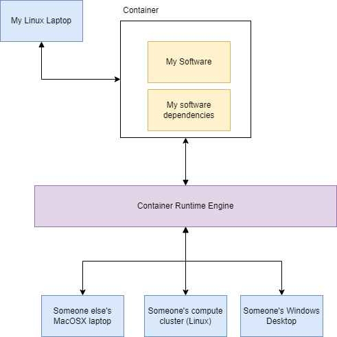
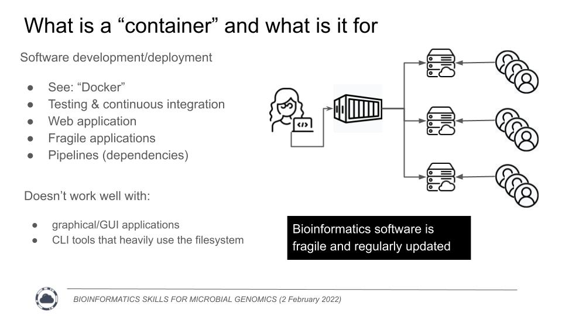

# The dark secret about containers in Bioinformatics

If you talk to your friendly neighbourhood bioinformatician (Binfie) these days, you might hear them mention "containers", "[docker](https://www.docker.com/)", and "[singularity](https://docs.sylabs.io/guides/2.6/user-guide/introduction.html#welcome-to-singularity)".
They'll talk about these as if these are the greatest things since PCR. I am not different; we've talked about containers at length on the [Micro Binfie Podcast](https://soundcloud.com/microbinfie/staph-b-stable-containers)

What are we/they on about?

I will explain all here in this post, and reveal our deep dark secret about bioinformatics software development.

## Containers are designed for rapid software deployment

To fully understand what's going on, we need to talk about trends in software development generally, and then cross back to how that applies to bioinformatics.

There has been a growing trend in software development to use a rapid and iterative development cycle. It is [generally accepted](https://en.wikipedia.org/wiki/Rapid_application_development)
that it is easier to quickly create a prototype, test it, show it to a client for feedback and revisions, and then repeat the cycle. You might have heard cute phrases like "Fail fast, suceed faster" or "aim for iteration,
not perfection". Agree or disagree, this is widely embraced in software engineering and any process that can help speed up this cycle of rapid deployment is considered a great boon.

This where Containers come in, containerisation is a form of virtualisation where you bundle the software you are working on, the development enviroment, and all the dependancies in a singular black box. The
container is run on top of a runtime engine that translate the inner working of the container to a range of different environments. Where ever the runtime engine can run, my
software can also run _regardless of the enviroment I have used for development_. For instance, if I write a piece of software on my Linux laptop and put it into a container,  
through the container runtime engine it can be run on someone else's computer whether it be a compute cluster, a MacOSX laptop or someone's
Windows machine. Yes, if you're thinking ahead, that means you could run bioinformatics software (developed solely for Linux) on a Windows machine.

For software developers this is very useful. It allows them to quickly stand up their software for clients to use and recieve rapid feedback. This could be an incredibly complex application
written with legacy code that can run anywhere; or it could be a web application that can could be automatically updated on a thousand different servers all over the world.
Most technology companies are internally using some form of containerisation / virutalisation somewhere in their development cycle. It is just too useful not to.

## Bioinformatics software is fragile and poorly designed

Now, how does that fit into bioinformatics? This comes back to our deep, dark secret - _Most Bioinformatics software is poorly written, relying on a complex and fragile stack of dependencies_.
These dependencies could be in any number of languages. A single pipeline could use a program written in C for the actual calculations, have some python scripts to shuffle the data around,
and then use some R for final plots and statistics. This is an incredible amount of bloated software to install for a singular task. If you've ever asked yourself "Does this really have
to be so hard to install? Am I just stupid?", the answer is No, it doesn't have to be this hard, and you are not stupid.

Indeed, we should streamline our software and make usability a priority. Software installation should be an easy "point and click" executable. There is a growing movement in
the field to address these issues, but it is slow going. We are rarely funded to improve software usability.

In the meantime, containers allows us Binfies to hid all of that ugly and fragile "academic" code we write in a neat singular black box for you to enjoy.

## Further reading

If you want to learn mor about containers and how to use them there is material from a recent workshop I co-chaired, BIOINFORMATICS SKILLS
FOR MICROBIAL GENOMICS, about `conda`, containers and workflow languages: https://www.climb.ac.uk/bioinformatics-skills-microbial-genomics/

If you want to use (docker) containers, STAPH-B has a great set of pre-built ones ready for you: https://github.com/StaPH-B/docker-builds
