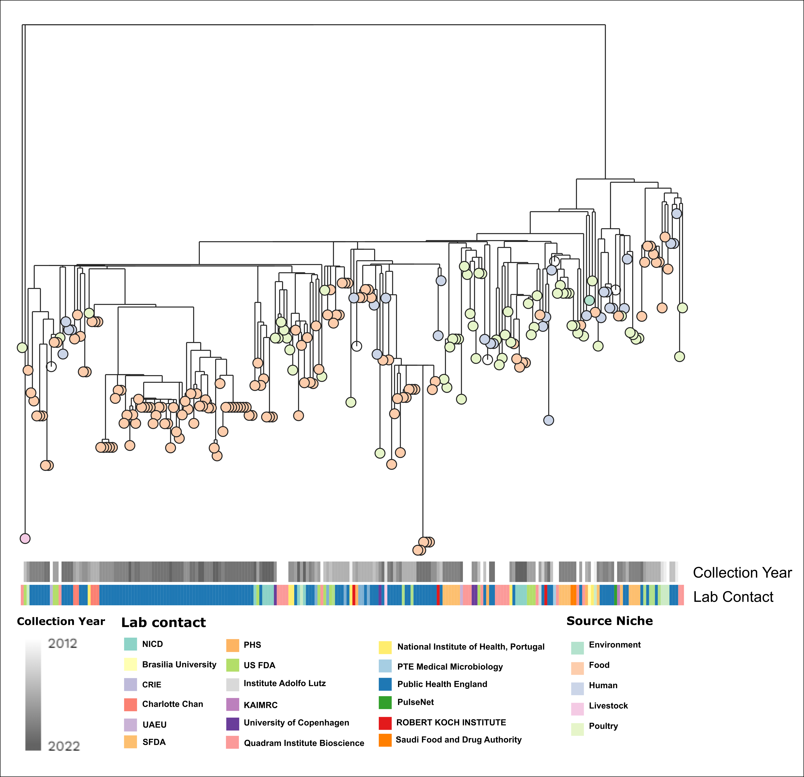
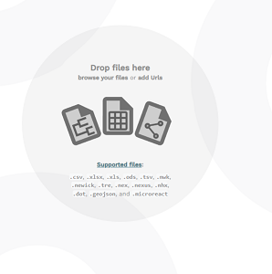
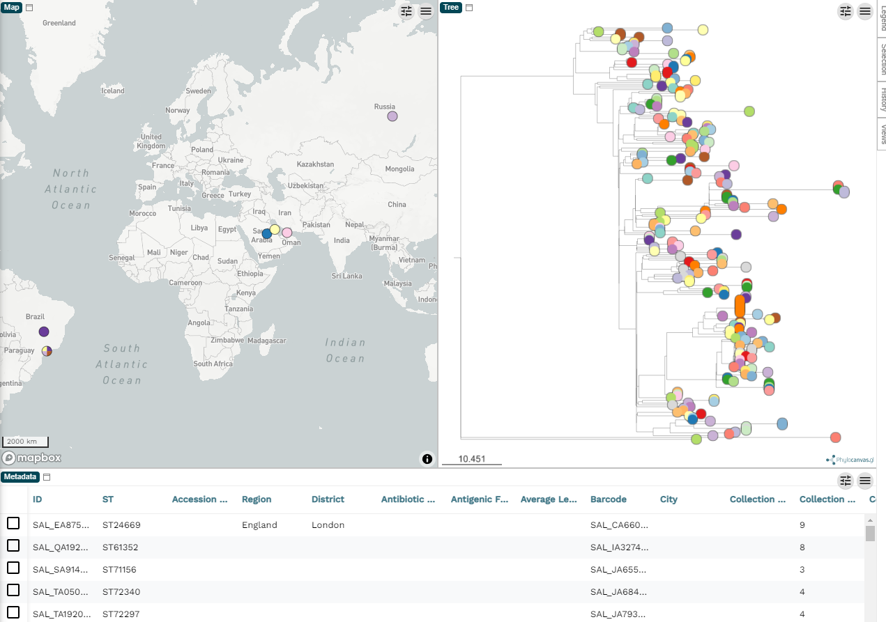
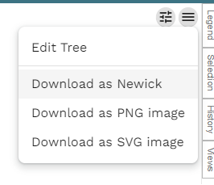
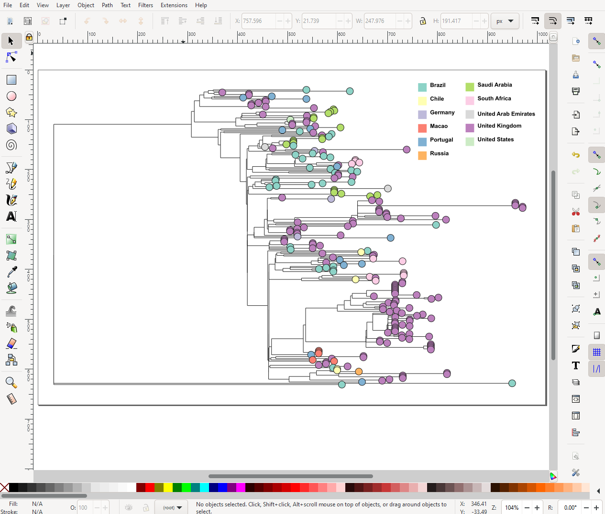
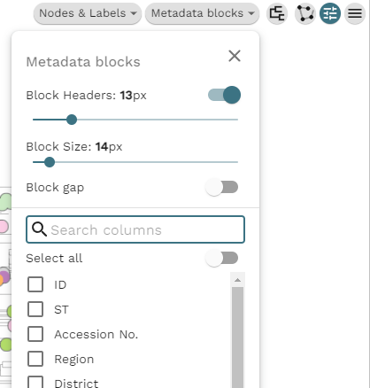
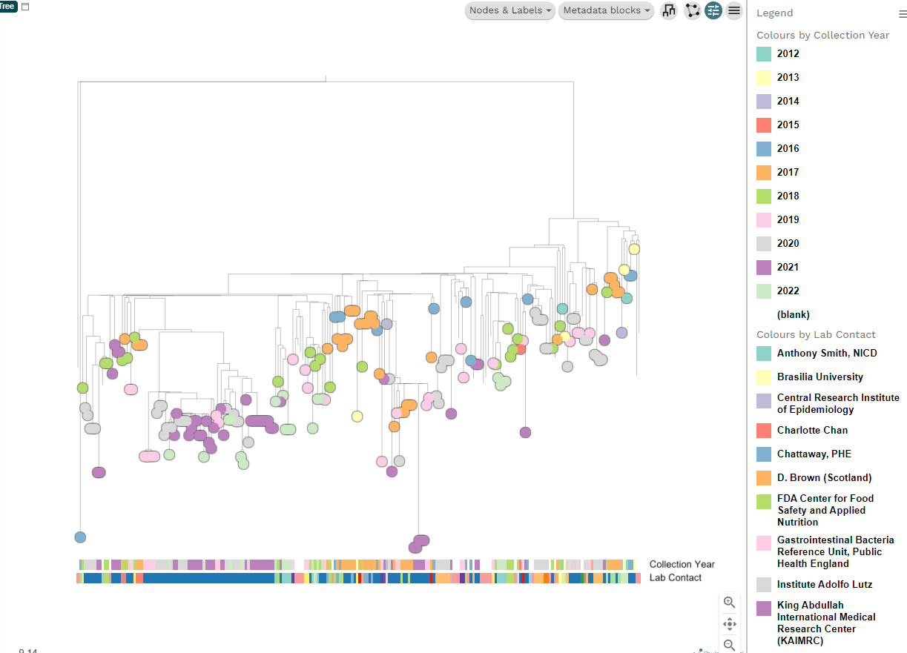
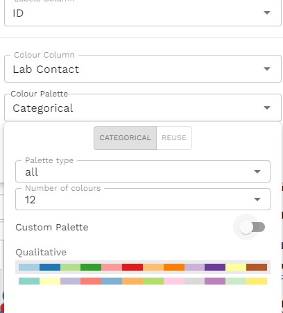
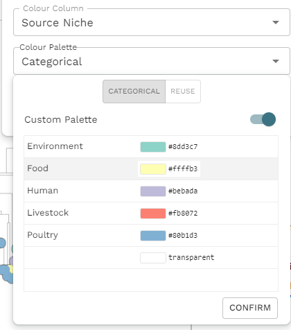

I make a lot of phylogenetic trees, and I have used a lot of different programs. In this post, I want to show you how to get the most out of the online visualization tool, [Microreact](https://microreact.org/), so you can draw publication ready figures. We will make a figure like this:

First, let's get some example data.

## Example data

I prefer to make worked examples from real data. Many common problems I encounter do not appear in simulated/toy datasets. To that end I have chosen some
genomes from _Salmonella enterica_ serovar Minnesota. I just randomly selected a group of genomes from EnteroBase. If you would like to know more, we discussed these in a recent publication: Alikhan et al. (2022)
PLoS Genet 18(6): e1010174. https://doi.org/10.1371/journal.pgen.1010174

The raw data is here if you want to follow along:

- [Table of metadata - tab delimited](/example_data/minne.06.22.tsv)
- [Phylogenetic tree - newick format](/example_data/minne.06.22.nwk)

# A basic tree with some metadata

When you go to the [Microreact website](https://microreact.org/), there is a link at the top to `upload` and from there you can drag and drop your tree (newick or nexus format) and your table of metadata onto the page.

It may ask you about which column is the ID. That is, which column should it use to link the labels in the tree file to the rows in the metadata. You do need to have at least one column in the metadata file that has the corresponding tip label in the tree file, otherwise the tree will be shown with no annotation. Once you choose the column the basic tree and metadata table will show up like below.

You can remove the map panel by clicking the `pencil` (top right), then `Edit existing panels` and then in the pop-up you can select the map panel and remove it. Some datasets benefit from the map view, but in this case the example data is quite sparse with the geographic information so we will ignore the map view here.

By default, the tree tips (the circles) are coloured by the ID, which is meaningless since they will all be unique. But before we get engrossed with creating our figure, let's figure out how we can export the images.

## Exporting figures from Microreact

There is a very obvious download icon (downward arrow and a line) in the top right, and you may think that this is where you can download your figure. Surprise! It isn't. This button allows you to download the original uploaded files back, i.e. the metadata table and the tree file. This is useful, but not right now. You actually want the grey menu icon (3 lines), within the tree panel (see below).

Now, this only allows you to download the tree image itself. You also want the legend/key as well. This is under the legend panel on the right-hand side. The panel is usually hidden at first, so click `Legend` to show it. Again, like the tree, there is the menu icon and under that is the option to download the legend. So you will have two seperate files downloaded, one of the tree itself and the legend. I recommend that you download both in `.svg` and put the two together in either [Inkscape](https://inkscape.org/) or [Adobe Illustrator](https://www.adobe.com/uk/products/illustrator.html). I will admit that working with either Inkscape or Illustrator can be difficult to learn, so if you are in a rush you can export the two images as `.png` and put the two together in Powerpoint.

## Changing colours for the tips

In the example image above, where I am stitching the two figures together in Inkscape, you will notice that I am showing the Country of sample collection rather than the ID. To change this yourself, you click the eye icon in the top right and select `Country` as the `Colour Column`. Under `Colour Palette` you can change the choice of colours.

# The advanced tree

Now, how do we get the detailed tree with those columns of metadata I presented at the beginning? Next to the menu icon in the tree panel, there is another icon with showing sliders. If you click on this, a panel of more options appears.

Under `Metadata blocks` you can select all the columns you want to show. If you are using the example data, the interesting columns are 'Collection Year' and 'Lab Contact'. The columns will appear next to the tree as soon as they are checked. The forked icon allows us to change the tree visualization itself, i.e. rectangular dendrogram, circular, radial, or hierarchical.

I have some tips on how to choose the best layout for your tree (based on the number of tips) in the section titled 'Choosing a layout' in [Drawing phylogenetic trees in R (ggtree)](/posts/ggtree-start/).

Anyway, if we select hierarchical we get something like this:

There are lot of options hidden in these new buttons like `Nodes and Labels`. If you want to show the label for each tip it is under `Nodes and labels` > `Leaf labels`. Have fun playing around with all the different options. If you make a mess and want to reset, you can refresh the page and re-upload the original files.

Once you get used to the user interface, you can make a decent figure in a few minutes with what I have shown you.

## Controlling the colour palette

You can have fine control of the colour palette, although it's not immediately clear how to do this. In the example data, let's change the collection year to a continuous gradient. First, select 'Collection Year' under the `Eye` (top right). Then under the `colour palette` change it to 'gradient', `number of steps`: 'continuous' and then choose the colours you like. I chose the greyscale at the bottom. You will notice that by switching the gradient to continuous, the legend has also changed to show a continuous colour gradient rather than discrete boxes for each year.

We repeat the same process for each metadata column we wish to change. We click the `Eye`, choose the colour column, then change the palette. For 'Lab contact' I chose 'Categorical', with number of colours as '12' and I picked one of the qualitative options.

As you do this, you'll notice that you are actually selecting the metadata column as the tip colour as well. It's a little confusing because you are using the interface that was likely designed to just change the tip colours and the feature of the metadata blocks was added later. It is workable if you just ignore the tip colours and concentrate on the metadata blocks. Once these have been settled, you can select the colour column that you would like for the tip labels and customise that last.

While you are doing this, you will notice the `Custom palette` toggle. If you activate this toggle, the panel will change allowing you to select individual colour for each value. A word of warning, however, _If you change the entire palette later, by untoggling `Custom palette` and choosing a new palette, all your custom colour selections will vanish!_ So, I strongly suggest you leave this step until the very end.

Using the steps described above, we can create the figure I showed at the start.

Once the figure is as you like, you can save the exact state with the `Save` button in the top right. You have the option to export the whole thing as a JSON file that you can load back in later. Or you can save the project to your account and create a permenant link to the tree that you can put into your pubications. I have done this for the demo tree and if you want to see this interactive version of the final tree, you can visit
[https://microreact.org/project/happykhan-demo](https://microreact.org/project/happykhan-demo)

# Other tree visualization software

If [Microreact](https://microreact.org/) is not quite what you are looking for, then there are other software you can use, such as:

- [iTOL](https://itol.embl.de/)
- [Figtree](http://tree.bio.ed.ac.uk/software/figtree/)
- [GrapeTree](https://achtman-lab.github.io/GrapeTree/MSTree_holder.html)

And there are numerous libraries you can use in `R`, like `ggtree` that [I describe here](/posts/ggtree-start/).
