Here are some notes on how to use `R` (specifically the `ggtree` package) to draw phylogenetic trees. In this first section, I will show:

- How to draw a basic tree, with coloured tips and tip labels.
- How to add a scale.
- A discussion on the different tree layouts

In other sections, I would like to cover how to make circular figures with heatmaps.

Firstly, what is `ggtree`?

> ‘ggtree’ extends the ‘ggplot2’ plotting system which implemented the grammar of graphics. ‘ggtree’ is designed for visualization and annotation of phylogenetic
> trees and other tree-like structures with their annotation data. https://github.com/YuLab-SMU/ggtree

## Example data

I prefer to make worked examples from real data. Many common problems I encounter do not appear in simulated/toy datasets. To that end I have chosen some
genomes from _Salmonella enterica_ serovar Minnesota. If you would like to know more, we discussed these in a recent publication: Alikhan et al. (2022)
PLoS Genet 18(6): e1010174. https://doi.org/10.1371/journal.pgen.1010174

The raw data is here if you want to follow along:

- [Table of metadata - tab delimited](/example_data/minne.06.22.tsv)
- [Phylogenetic tree - newick format](/example_data/minne.06.22.nwk)

This does not directly correspond to the Minnesota tree in the paper, so do not expect it to match.

# Making a basic tree with coloured tips

The most basic annotate tree with coloured tips for countries with an included key/legend and scale.
In terms of configuring the tree scale on `geom_treescale`:

- Position with x,y.
- Width is the length of the tree scale
- Offset is the relative position of the line and the text

```r
options(repr.plot.width=7, repr.plot.height=7) ; par(oma=c(0,0,0,0))
# Change height/width to rescale your figure

# Load in metadata, it is tab delimited hence we use `sep`
info <- read.csv("minne.06.22.tsv", sep="\t", header=TRUE)

# Load in the newick file
all_tree <- read.tree("minne.06.22.nwk")
all_tree <- root(all_tree, 'SAL_AB9236AA_AS') # This is an outgroup I picked for the tree.

# Just shrinking some long branches so it's clearer
# Don't distort your actual data this way without good reason.
all_tree$edge.length[all_tree$edge.length  > 100  ]  <- 100

p1 <- ggtree(all_tree) %<+% info +
    geom_tippoint(aes(color=Country)) + # Colour code the tips with country
    # Adding in a scale
    geom_treescale(x=0, y=45, fontsize=4, linesize=2, offset=2, width=10)

plot(p1)
```

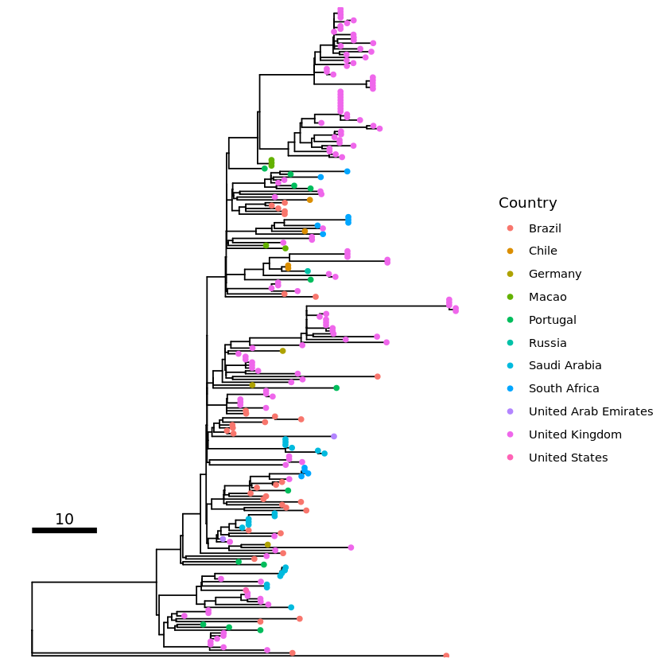

## Adding tip labels

Tip labels can be tricky. Some trees, like this example one, can look very cluttered when tip labels are shown. I do not believe
there is an easy fix for this. If you do encounter this problem you can try:

- Increasing the figure scale. You can rescale the figure with the repl options i.e. `options(repr.plot.width=7, repr.plot.height=7)`.
- Align the labels to the edge (shown below with `as_ylab`)
- Use a different tree layout. i.e. `ggtree(tree, layout="circular")`, see section below on "Choosing a layout"

For rectangular and dendrogram layouts you can use `as_ylab` to align all the labels to the edge.

```r
options(repr.plot.width=7, repr.plot.height=7)

tip_label1 <- p1 + geom_tiplab(size=2)
plot(tip_label1)

tip_label2 <- p1 + geom_tiplab(size=2,  as_ylab=TRUE)
plot(tip_label2)
```

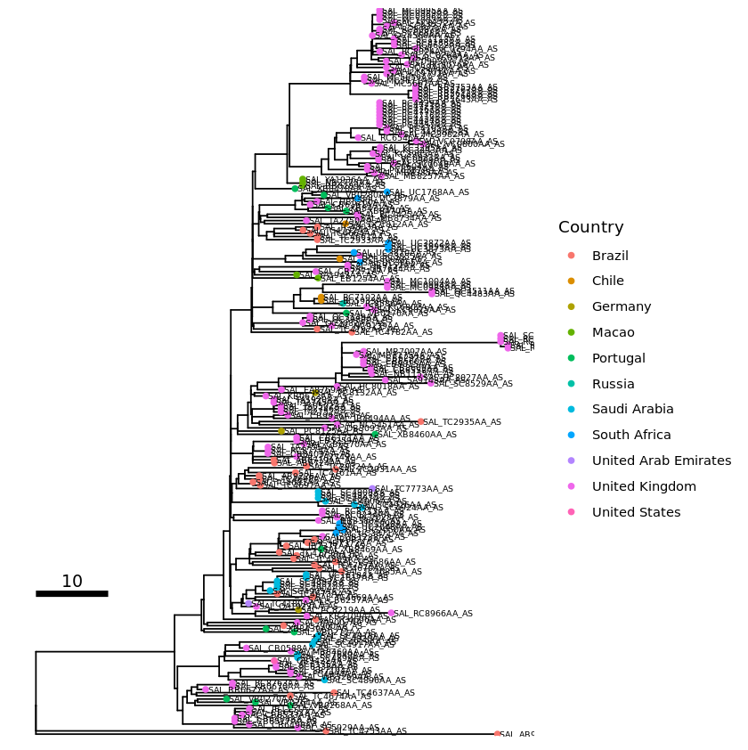

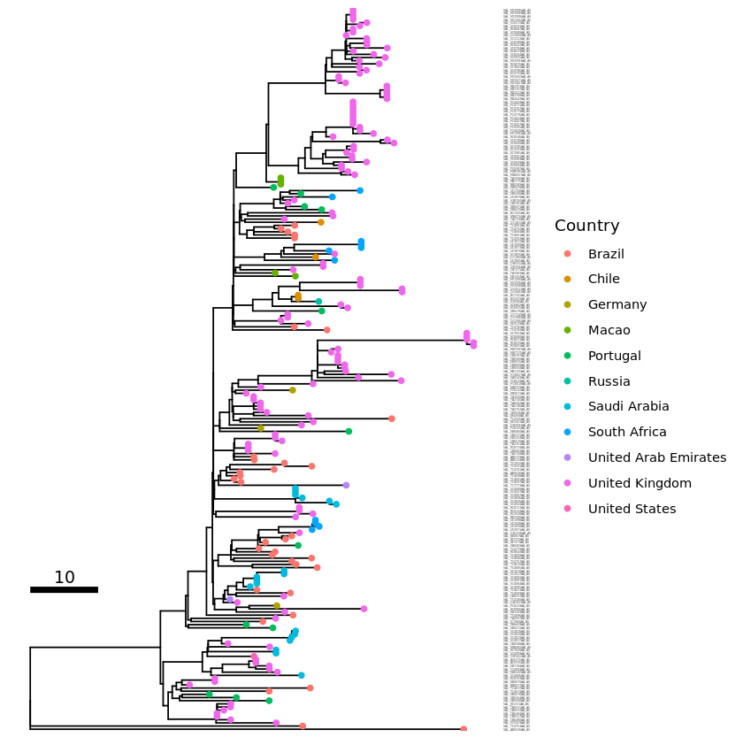

# Choosing a layout

Different layouts have different benefits and drawbacks. Layouts can support different number of tips on the figure.
In general, rectangular displays the data most clearly, but circular layouts can fit more tips (and labels) before
it becomes cluttered. In practice I would start with a rectangular layout (like the basic sample above) and if it is too
cluttered, I would then try a circular layout.

There are other layouts, but I avoid these for different reasons. Of these, daylight and equal angle can look very
pretty but cannot show more than tens of tips. They also cannot indicate the root clearly, which can be a problem
for people who insist that all phylogenetic trees must have a root. I do not strictly agree with this. Phylogenies
can be used to just to illustrate which taxa cluster with which, and in that case an unrooted tree is fine.
The author, however, should clearly state they are not trying to determine which clade came first
(evolutionary speaking) but they are just illustrating that the clades are there.

Here are some limits to help you pick the best layout given the number of tips in the tree:

| Layout            | Max number of tips | Max number of tips (with labels) |
| ----------------- | ------------------ | -------------------------------- |
| Equal angle       | 50                 | 20                               |
| Daylight          | 100                | 50                               |
| Rectangle/slanted | 300                | 100                              |
| Circular          | 800                | 300                              |

You can also draw the tree ignoring branch lengths, which might make it easier to show the topology. e.g. `ggtree(tree, layout="daylight", branch.length = 'none')`.
In that case, be sure to state clearly that the branch lengths are not to scale.

See https://xiayh17.gitee.io/treedata-book/chapter4.html section 4.2.2 for different layouts you can choose.

## Examples without tip labels - with randomly generate tree data

```r

options(repr.plot.width=7, repr.plot.height=7) ; par(oma=c(0,0,0,0))
# Change height/width to rescale your figure

my_tree = rtree(50)
ggtree(my_tree, layout="equal_angle") + geom_tippoint()

my_tree = rtree(100)
ggtree(my_tree, layout="daylight") + geom_tippoint()

my_tree = rtree(300)
ggtree(my_tree) + geom_tippoint()

my_tree = rtree(700)
ggtree(my_tree, layout="circular")  + geom_tippoint()
```

**Equal angle layout**
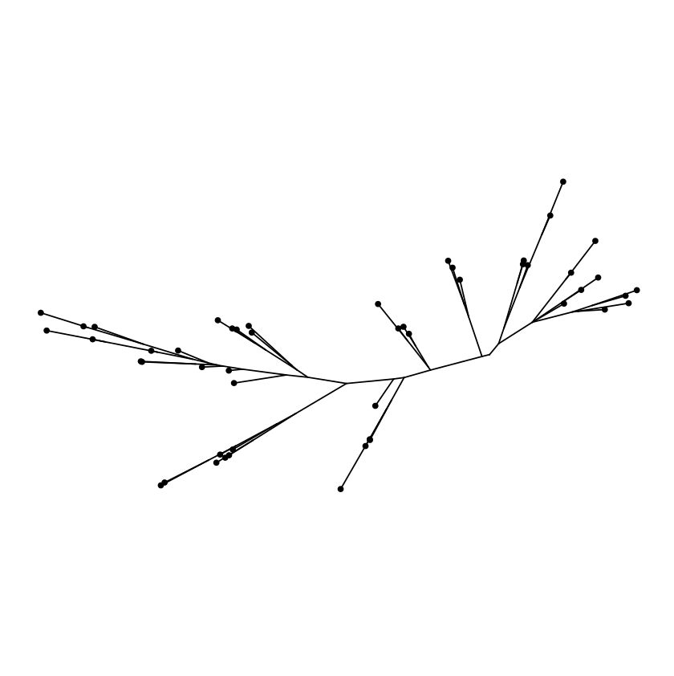

**Daylight layout**
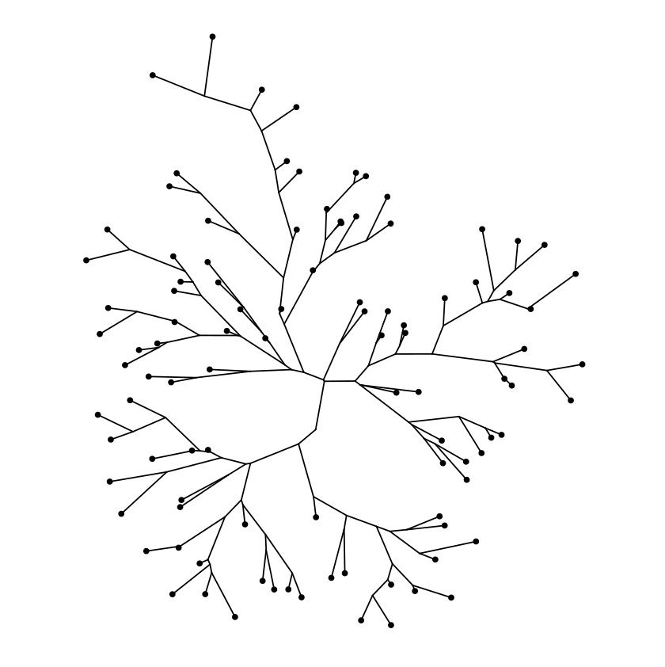

**Rectangular layout**
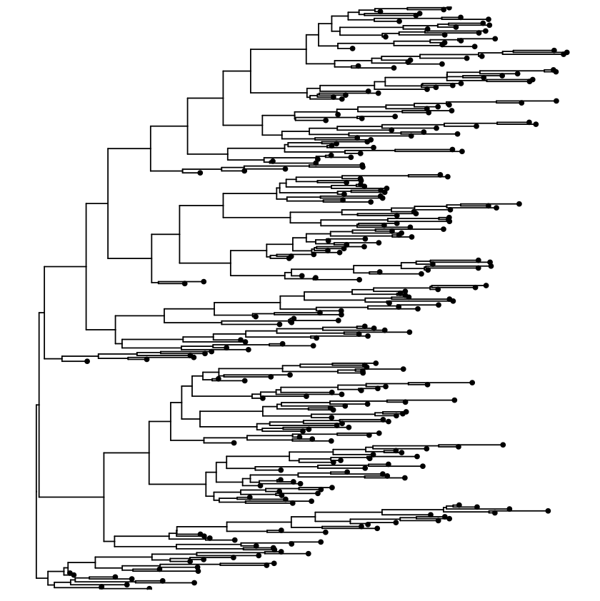

**Circular layout**
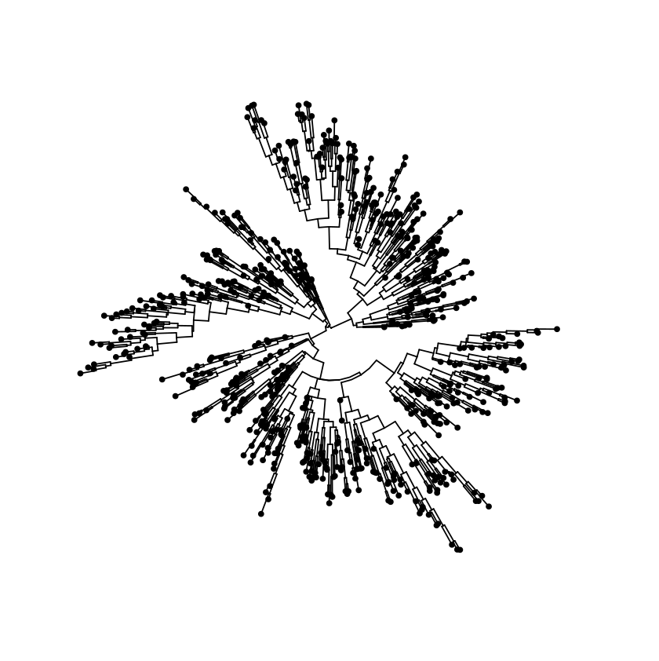

## Examples with tip labels - with randomly generate tree data

```r

options(repr.plot.width=7, repr.plot.height=7) ; par(oma=c(0,0,0,0))
# Change height/width to rescale your figure

my_tree = rtree(20)
ggtree(my_tree, layout="equal_angle") + geom_tiplab()

my_tree = rtree(50)
ggtree(my_tree, layout="daylight") + geom_tiplab()
my_tree = rtree(100)
ggtree(my_tree) + geom_tiplab(size=2)
my_tree = rtree(300)
ggtree(my_tree, layout="circular") +
    geom_tiplab(align=T, linetype=NA, size=2)
```

**Equal angle layout with labels**
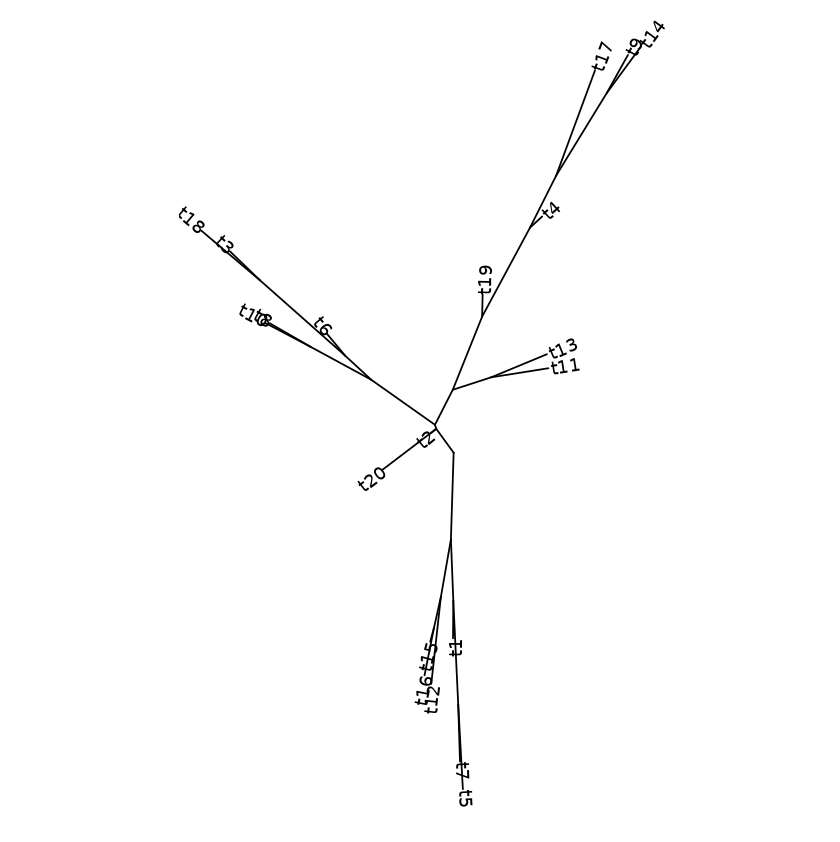

**Daylight layout with labels**
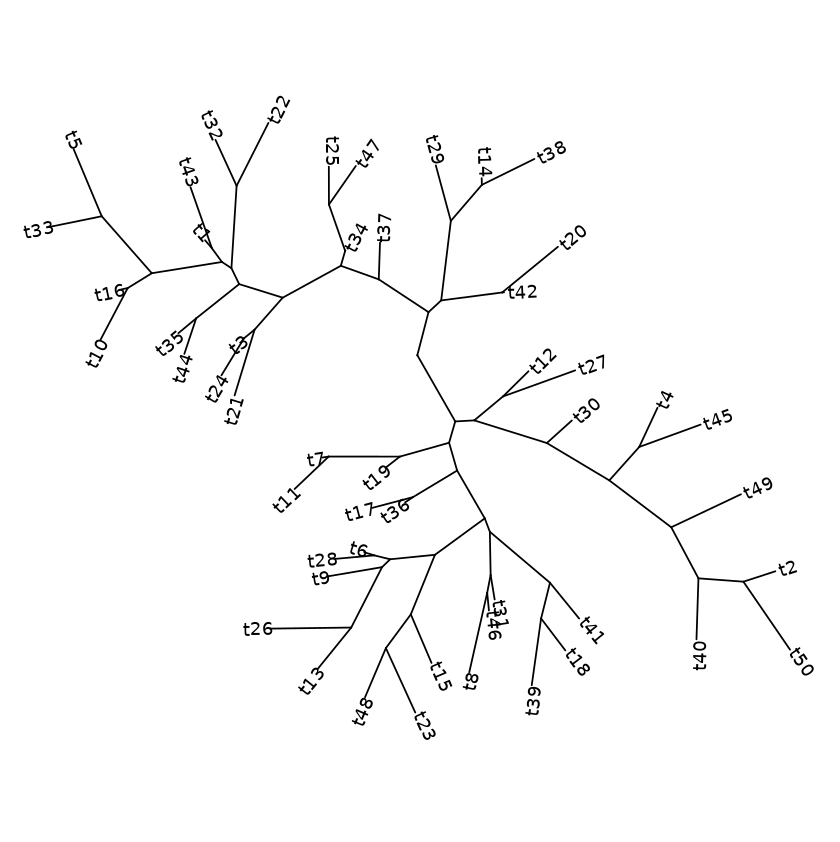

**Rectangular layout with labels**
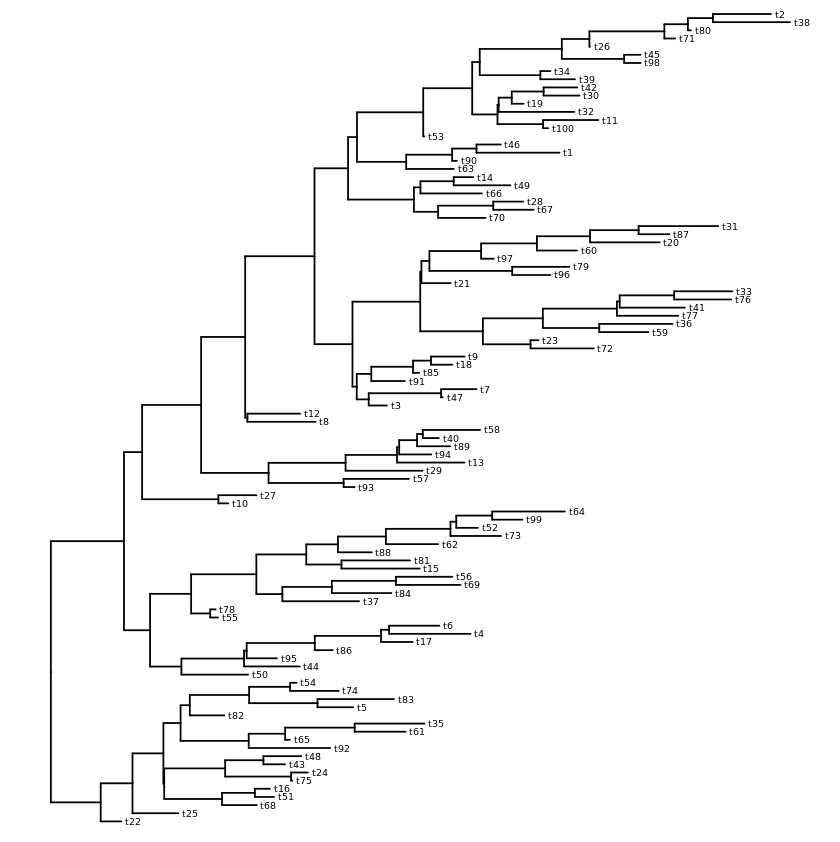

**Circular layout with labels**
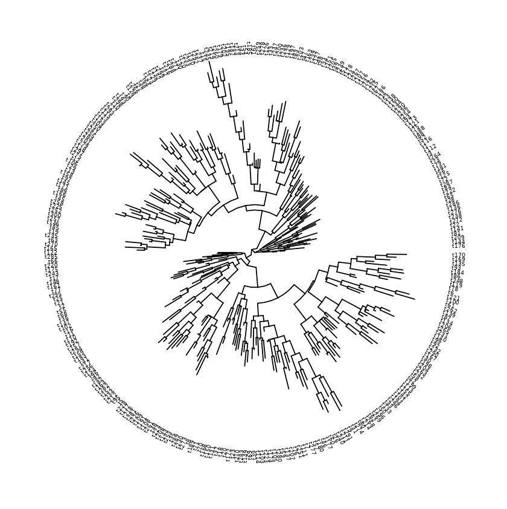
