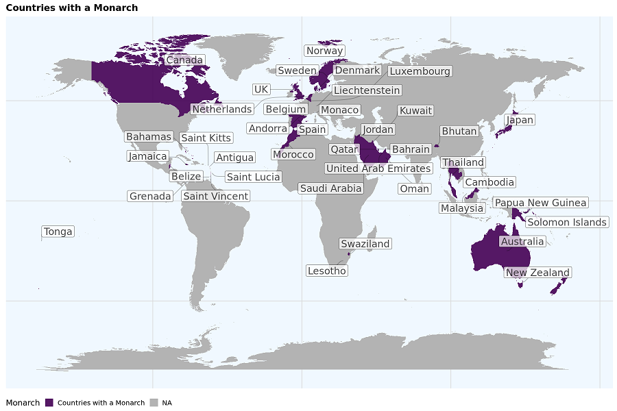

I recently made a map in R showing our SARS-CoV-2 collaborations. I thought
that it came out really well and maybe other people might want to make a map
(about anything). Here I will show you how to make a map in R that shows which
countries have a monarchy, as a simple illustrative example.

Here is what the final map looked like:



**Requirements:**

- `R`
- `ggplot2`
- `sf`
- `dplyr`
- `ggrepel`
- `cowplot`
- `maps`

I had some difficulties installying `cowplot` and `sf` natively on my laptop,
I only found it possible by installing `R` and the packages in a `conda` environment.
I explain [how to do this, here](/posts/conda-install-r).

This post is part of a series about making maps in R:

- [Making a map in R](/posts/making-a-map-in-r)
- [Advanced map making in R](/posts/advanced-map-making-in-r)
- [Variations on map projections in R](/posts/map-projections-in-r)

The Full `R` script is here:

```r file=map.R
library(ggplot2)
library(sf)
# install sf via conda, esp. if you have installed R through conda.
library(dplyr)
library(ggrepel)
library(cowplot)
require(maps)

# Resize the final preview figure.
options(repr.plot.width=15, repr.plot.height=10)

# Countries with a Monarchy. A list from the internet.
my_countries <- c( "Andorra", "Antigua", "Australia",  "Bahamas", "Bahrain", "Belgium",
"Belize", "Bhutan", "Cambodia",  "Canada", "Denmark", "Swaziland",
"Grenada", "Jamaica", "Japan", "Jordan", "Kuwait", "Lesotho", "Liechtenstein",
"Luxembourg",  "Malaysia", "Monaco", "Morocco", "Netherlands",
"New Zealand", "Norway", "Oman", "Papua New Guinea", "Qatar", "Saint Kitts",
"Saint Lucia", "Saint Vincent", "Saudi Arabia", "Solomon Islands",
"Spain", "Sweden", "Thailand", "Tonga", "Tuvalu", "United Arab Emirates", "UK",
"Vatican City")

# Retrieve the map data
country.maps <- map_data("world")

# Mutation to indicate which countries to highlight
country.maps <- mutate(country.maps ,
    Monarch = ifelse(region %in% my_countries,
        "Countries with a Monarch", NA))

# This is to position the region name labels
country.maps.labels <- country.maps %>%
   group_by(region) %>%
   filter(region %in% my_countries) %>%
   summarise(long = mean(long), lat = mean(lat))

# Now to plot
p <- ggplot(country.maps, aes(x = long, y =lat)) +
  ggtitle("Countries with a Monarch") +
  # We fill according to the value in the Monarch field. See mutation above,
  # Differnt values in the Monarch field (e.g. the Monarch's name) would give
  # different colour coding
  geom_polygon(aes( group = group, fill = Monarch)) +
  # geom_label_repel to automatically spread out the labels
  geom_label_repel(data = country.maps.labels, aes(x = long, y = lat, label = region),
                  nudge_x = .1, nudge_y = 0.1,
                  point.padding = unit(0.1, "lines"),
                  size = 6,
                  force_pull = 5,
                  segment.alpha = 0.3,
                  min.segment.length = 0.5,
                  alpha = 0.7, show.legend = F,
                  box.padding = 0.5,
                  segment.curvature = -0.01,
                  segment.ncp = 1,
                  segment.angle = 30,
                  max.overlaps = 50,
                  force = 5) +
  scale_fill_viridis_d(na.value='grey70', alpha = .9) +
  theme_minimal_grid() +
  theme(legend.position = "bottom",
    # Remove all the axis around the edges
       axis.title.y=element_blank(),
       axis.ticks.y=element_blank(),
       axis.text.y=element_blank(),
       axis.ticks.x=element_blank(),
       axis.text.x=element_blank(),
       axis.title.x=element_blank()) +
      theme(panel.background = element_rect(fill = "aliceblue"))
      # Colour the background/ocean
p
```

You may want zoom in on a certain part of the world. You can do so by giving specific latitudes and longitudes
to `coord_sf`. The example below takes our previous map and clips out Antarctica and New Zealand.
Because it is not a real map if it does not clip out New Zealand.

```r
 # coord_sf specifies the lat/long boundaries to zoom in.
 # Value are picked manually looking at google maps.
p <- p +     coord_sf(ylim = c(70, -60), xlim = c(-125 , 160), expand = FALSE)

p
```


BTW, as a final reminder; You can save the output with `ggsave`

```r
ggsave(p, filename = "map.png",  width = 15, height = 5)
ggsave(p, filename = "map.svg",  width = 15, height = 5)
```

If you want to play around with the map projection, use `coord_map` like below.
To do this, you may need to install `r-mapproj` as well.

```r
if (require("maps")) {
newmap <- ggplot(country.maps, aes(x = long, y =lat)) +
  geom_polygon(aes( group = group, fill = Monarch)) +
    coord_map("orthographic") +

      scale_fill_viridis_d(na.value='grey70', alpha = .9) +
  theme_minimal_grid()
newmap
}
```


