In this example we will:

- Use some crazy projections
- Do some themeing for our maps

Inspired by https://xkcd.com/977/

**Requirements:**

- `R`
- `ggplot2`
- `sf`
- `rnaturalearth`
- `lwgeom`
- `cowplot`
- `rnaturalearthhires`
- `rnaturalearthdata`

If you have difficulties installing `rnaturalearth` and `sf` natively on your system,
I have found it possible by installing `R` and the packages in a `conda` environment.
I explain [how to do this, here](/posts/conda-install-r).

This post is part of a series about making maps in R:

- [Making a map in R](/posts/making-a-map-in-r)
- [Advanced map making in R](/posts/advanced-map-making-in-r)
- [Variations on map projections in R](/posts/map-projections-in-r)

# Getting started

```r
library("rnaturalearth")
library("ggplot2")
library(sf)
library(lwgeom)
library(cowplot)

# You also need to install rnaturalearthhires for this to work.
# devtools::install_github("ropensci/rnaturalearthhires")
# devtools::install_github("ropensci/rnaturalearthdata")

# Get some data to put on the map

label_frame <- data.frame("Label" = c("Brisbane", "Perth"), "Lat" = c(-27.4705, -31.9523), "Lon" = c(153.0260, 115.8613))
label_frame <- st_as_sf(x=label_frame, coords = c("Lon", "Lat"), crs = "EPSG:4326")
```

# Projections in R

I will post the projection and the R script stuff below it.

## Van der Grinten (4)

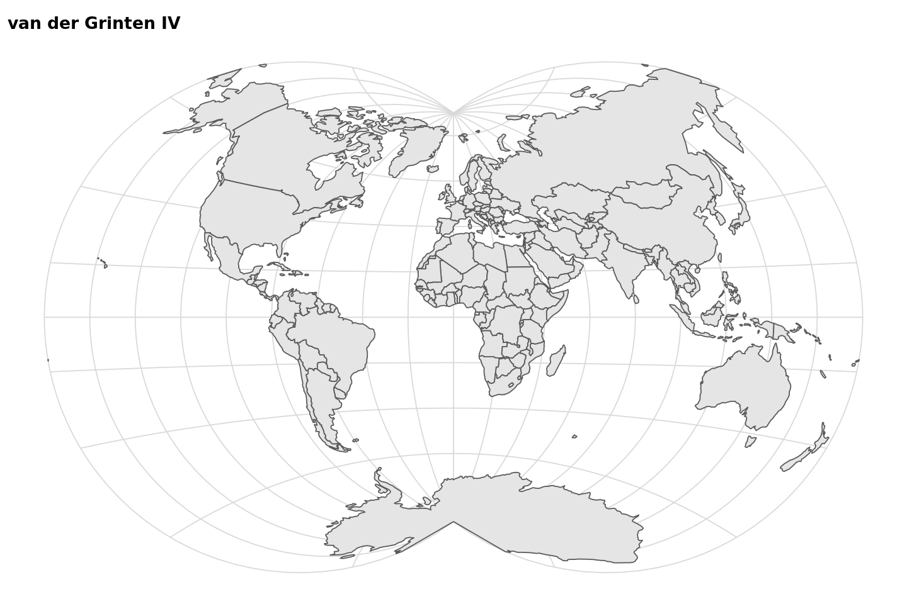

```r
options(repr.plot.width=12, repr.plot.height=8)

world_sf <- ne_countries(returnclass = "sf")

# Themed with minimal grid from cowplot

world <- ggplot() +
    geom_sf(data = world_sf )  +
    ggtitle("van der Grinten IV")+
  theme_minimal_grid()+
    coord_sf(crs= "+proj=vandg4")
world
```

## Robinson Projection

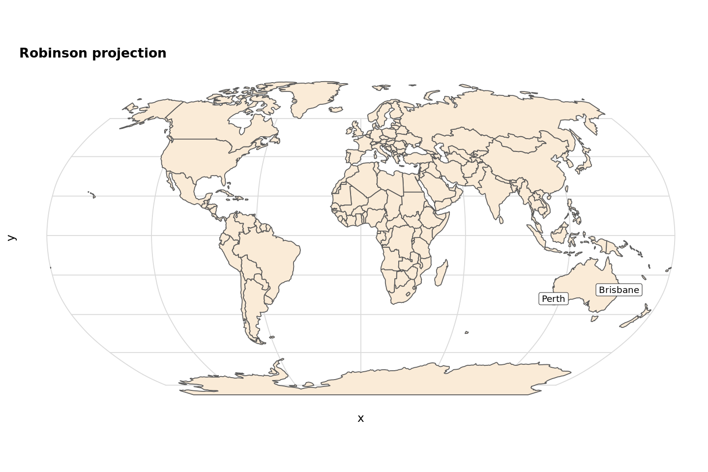

```r
world_sf <- ne_countries(returnclass = "sf")

world <- ggplot() +
    geom_sf(data = world_sf, fill= "antiquewhite")  +
    geom_sf_label(data = label_frame, aes(label = Label)) +
    coord_sf(crs= "+proj=robin") +
    theme_minimal_grid() +
    ggtitle("Robinson projection")
world
```

## Winkel tripel projection

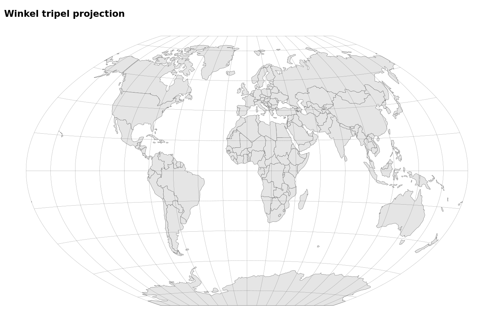

From: https://wilkelab.org/practicalgg/articles/Winkel_tripel.html

```r

crs_wintri <- "+proj=wintri +datum=WGS84 +no_defs +over"
world_wintri <- st_transform_proj(world_sf, crs = crs_wintri)

grat_wintri <-
  st_graticule(lat = c(-89.9, seq(-80, 80, 20), 89.9)) %>%
  st_transform_proj(crs = crs_wintri)


ggplot(world_wintri) +
  geom_sf(size = 0.5/.pt) +
  geom_sf(data = grat_wintri, color = "gray30", size = 0.25/.pt) +
  coord_sf(datum = NULL) +
  theme_map() +
    ggtitle("Winkel tripel projection")
```

## Interrupted Goode Homolosine projection

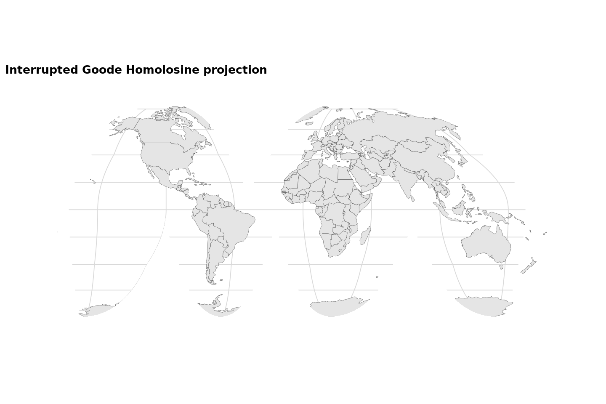

From https://wilkelab.org/practicalgg/articles/goode.html

```r

options(repr.plot.width=12, repr.plot.height=8)

world_sf <- ne_countries(returnclass = "sf")
crs_goode = "+proj=igh"

# projection outline in long-lat coordinates
lats <- c(
  90:-90, # right side down
  -90:0, 0:-90, # third cut bottom
  -90:0, 0:-90, # second cut bottom
  -90:0, 0:-90, # first cut bottom
  -90:90, # left side up
  90:0, 0:90, # cut top
  90 # close
)
longs <- c(
  rep(180, 181), # right side down
  rep(c(80.01, 79.99), each = 91), # third cut bottom
  rep(c(-19.99, -20.01), each = 91), # second cut bottom
  rep(c(-99.99, -100.01), each = 91), # first cut bottom
  rep(-180, 181), # left side up
  rep(c(-40.01, -39.99), each = 91), # cut top
  180 # close
)

goode_outline <-
  list(cbind(longs, lats)) %>%
  st_polygon() %>%
  st_sfc(
    crs = "+proj=longlat +ellps=WGS84 +datum=WGS84 +no_defs"
  )

goode_outline <- st_transform(goode_outline, crs = crs_goode)

# get the bounding box in transformed coordinates and expand by 10%
xlim <- st_bbox(goode_outline)[c("xmin", "xmax")]*1.1
ylim <- st_bbox(goode_outline)[c("ymin", "ymax")]*1.1

# turn into enclosing rectangle
goode_encl_rect <-
  list(
    cbind(
      c(xlim[1], xlim[2], xlim[2], xlim[1], xlim[1]),
      c(ylim[1], ylim[1], ylim[2], ylim[2], ylim[1])
    )
  ) %>%
  st_polygon() %>%
  st_sfc(crs = crs_goode)

# calculate the area outside the earth outline as the difference
# between the enclosing rectangle and the earth outline
goode_without <- st_difference(goode_encl_rect, goode_outline)

world <- ggplot(data = world_sf) +
  geom_sf(size = 0.5/.pt) +
  geom_sf(data = goode_without, fill = "white", color = "NA") +
  coord_sf(crs = crs_goode) +
  theme_minimal_grid()+
    ggtitle("Interrupted Goode Homolosine projection")
world
```

# Hobo Dyer projection

A lot of these projections like Gall Peters and Hobo Dyer are Equal Area Cylindrical projections with specific settings.

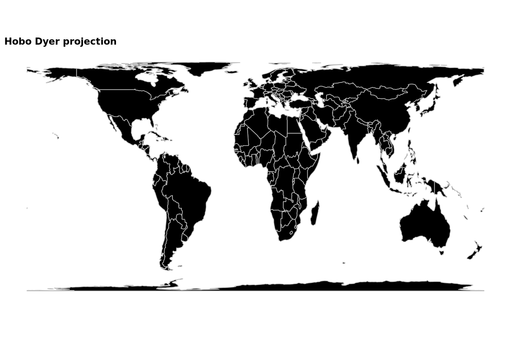

```r
options(repr.plot.width=12, repr.plot.height=8)

world_sf <- ne_countries(returnclass = "sf")

world <- ggplot() +
    geom_sf(data = world_sf, color = "grey", fill = "black")  +
    ggtitle("Hobo Dyer projection")+
  theme_map()+
    coord_sf(crs= "+proj=cea +lon_0=0 +lat_ts=37.5 +x_0=0 +y_0=0 +ellps=WGS84 +units=m +no_defs")
world

```

## Equidistant Cylindrical (Plate Carrée)

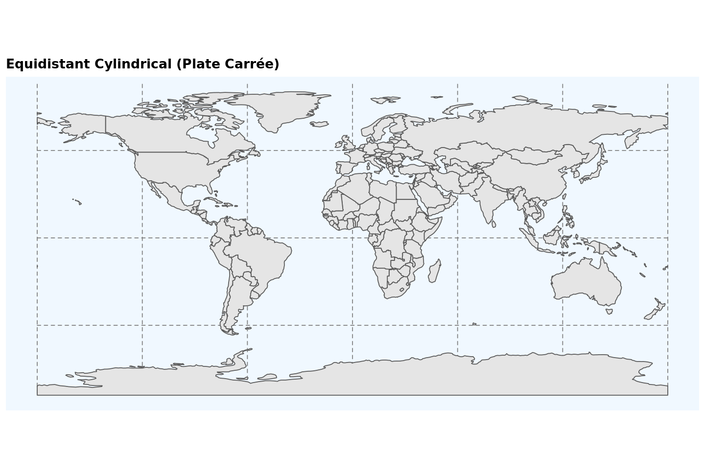

```r
options(repr.plot.width=12, repr.plot.height=8)

world_sf <- ne_countries(returnclass = "sf")

world <- ggplot() +
    geom_sf(data = world_sf)  +
    ggtitle("Equidistant Cylindrical (Plate Carrée)") +
  theme_minimal_grid()+
    coord_sf(crs= "+proj=eqc") +
    theme(panel.grid.major = element_line(color = gray(.5), linetype = "dashed", size = 0.5),
          panel.background = element_rect(fill = "aliceblue"))
world
```

## Globes!

A lot of options for a globe Orthographic (`+proj=ortho`) works fine but the proportions look a bit flat.

- Geostationary Satellite View : `+proj=geos +h=35785831.0 +lon_0=-70 +sweep=y`
- There's also Near-sided perspective: `+proj=nsper +h=3000000 +lat_0=-23 +lon_0=130`
- Lambert azimuthal equal-area projection is another option

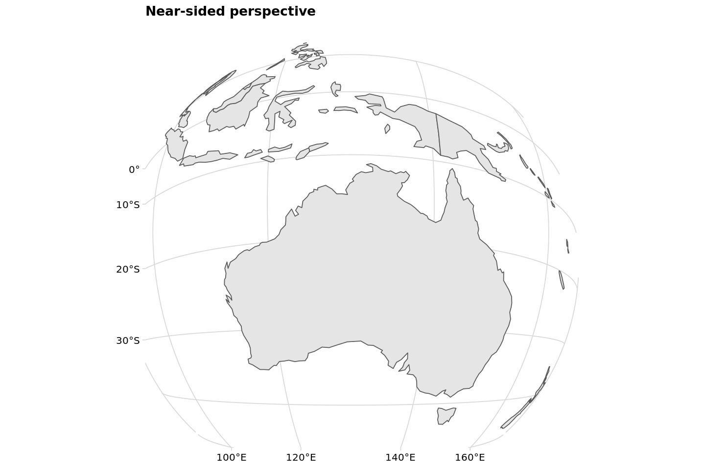

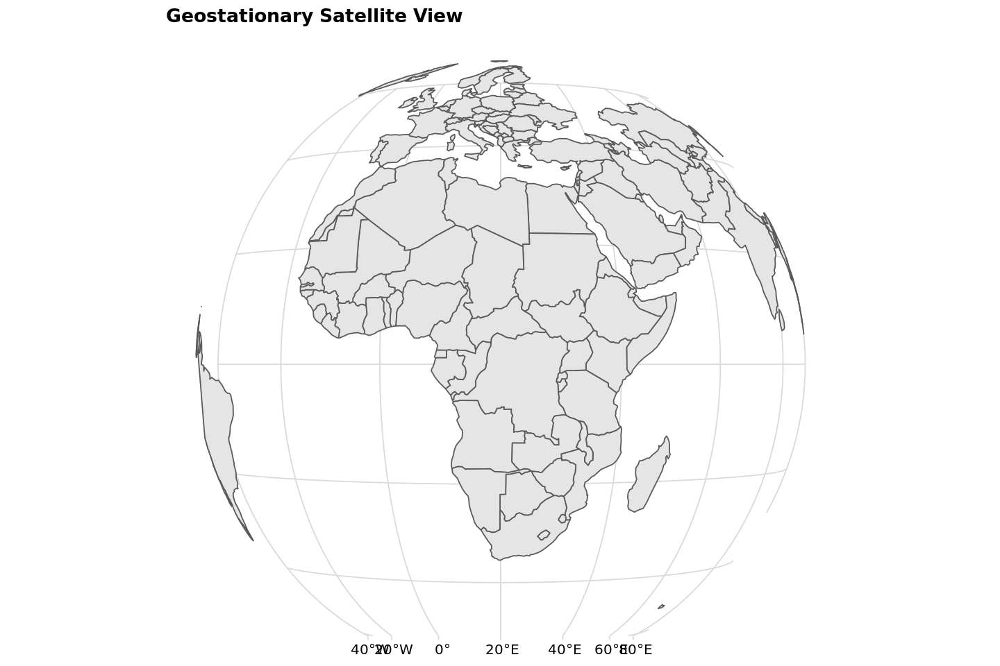

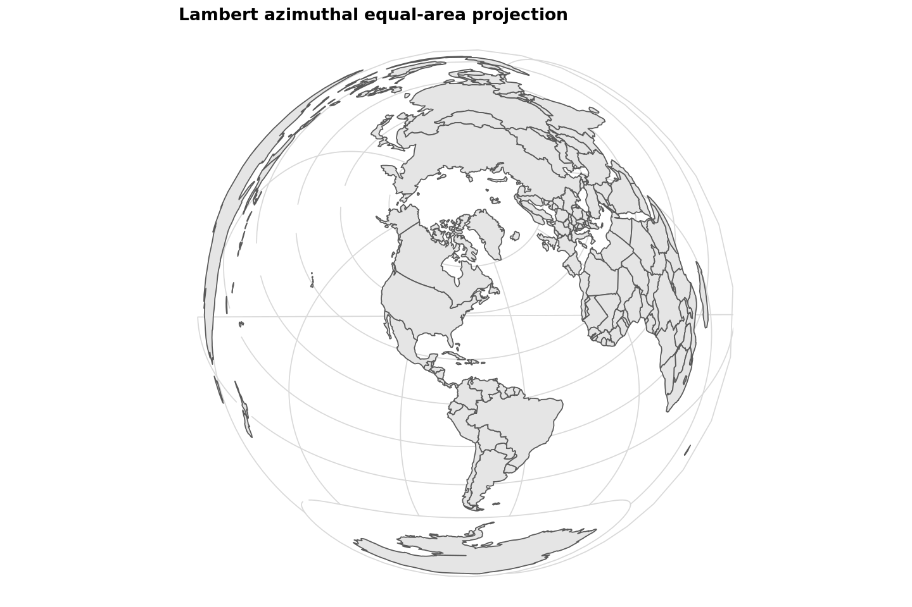

```r
options(repr.plot.width=12, repr.plot.height=8)

world_sf <- ne_countries(returnclass = "sf")

world <- ggplot() +
    geom_sf(data = world_sf)  +
    ggtitle("Near-sided perspective") +
  theme_minimal_grid()+
    coord_sf(crs= "+proj=nsper +h=3000000 +lat_0=-23 +lon_0=130")

world


world <- ggplot() +
    geom_sf(data = world_sf)  +
    ggtitle("Geostationary Satellite View") +
  theme_minimal_grid()+
    coord_sf(crs= "+proj=geos +h=35785831.0 +lon_0=20 +sweep=y ")

world

world <- ggplot() +
    geom_sf(data = world_sf)  +
    ggtitle("Lambert azimuthal equal-area projection") +
  theme_minimal_grid()+
    coord_sf(crs= "+proj=laea +x_0=0 +y_0=0 +lon_0=-74 +lat_0=40")
world
```

# Peirce Quincuncial & Waterman butterfly

Doesn't really work, I don't think it is supported.
Someone implemented something for R here: https://github.com/cspersonal/peirce-quincuncial-projection

Waterman butterfly is also not implemented either.

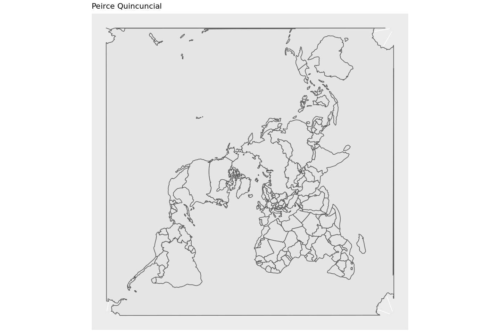

```r
world <- ggplot() +
    geom_sf(data = world_sf)  +
    ggtitle("Peirce Quincuncial") +
    coord_sf(crs= "+proj=peirce_q +lon_0=25 +shape=square")

world
```

## Gall Peters projection

A lot of these projections like Gall Peters and Hobo Dyer are Equal Area Cylindrical projections with specific settings.

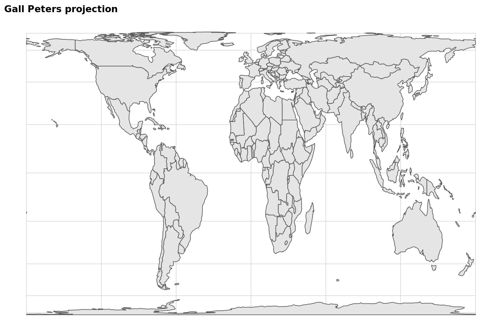

```r
world <- ggplot() +
    geom_sf(data = world_sf)  +
    ggtitle("Gall Peters projection") +
  theme_minimal_grid()+
    coord_sf(crs= "+proj=cea +lon_0=0 +x_0=0 +y_0=0 +lat_ts=45 +ellps=WGS84 +datum=WGS84 +units=m +no_defs")

world
gall.png
```
