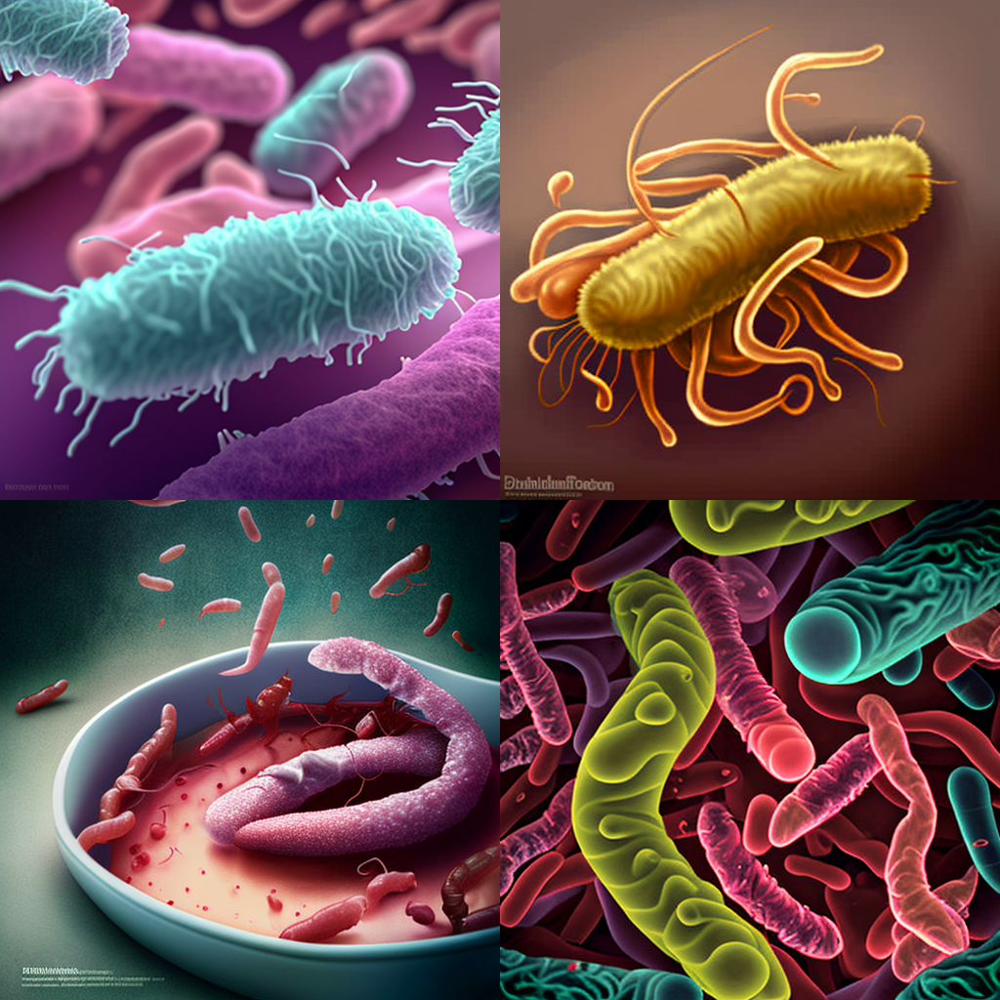

[Midjourney](https://www.midjourney.com/) is a proprietary artificial intelligence program that creates images from textual descriptions. You interact with the Midjourney bot on [Discord](https://discord.com/). There is a free trial, but ultimately Midjourney is a paid service. There is a choice of plans to choose from. There are alternative software such as the free [Craiyon](https://www.craiyon.com/) (formerly DALL-E Mini), and freemium [DALL-E and DALL-E 2](https://openai.com/blog/dall-e/). There is also the open source (and free) [Stable diffusion](https://stability.ai/blog/stable-diffusion-public-release) that you can run on your own hardware.

In Midjourney, you give the bot a prompt, such as `genome pop art` and it gives you a picture.

The software had become famous for producing surreal and moody images, creating beautiful pictures from very short prompts. The AI is described as having its own 'style'. One of the critical issues, however, is that it struggled with literal instructions in prompts.

Say, we asked for a picture of `a man and a dog`. It might draw a man and a dog. It might draw a figure that _looks_ like a dog, but with some confusing proportions or extra limbs. It might omit either the man or the dog. Or it may decide to merge the man and the dog in a horrifying way. Midjourney (up to and including version 3) behaved like an artist that thinks they knows better.

The creators have been working several months to address this, with a new version that could produce more photo realistic images and understand prompts more literally. They appear to have been successful with the release of version 4. Alpha testing for Midjourney version 4 was announced on the 5th of November 2022. The creators explain that:

> V4 is an entirely new codebase and totally new AI architecture. It's our first model trained on a new Midjourney AI supercluster and has been in the works for over 9 months. V4 isn't the final step, but our first step, and we hope you all feel it as the new beginning of something deep and unfathomable.

In this post, I compare the images produced from the new version 4 with the previous version 3. I tried to pick prompts that I might use as quick illustrations in a seminar or here on the blog. These prompts include:

- "A female scientist in a laboratory holding a pipette"
- "population genetics"
- "a conference hall full of scientists"
- "Salmonella"
- "laboratory scientist propaganda poster"
- "A painting of graduates by Johannes Vermeer"

Overall, I am very impressed with the output from version 4. It takes prompts more literally and looks really good. It does not have the surreal dreamlike quality of v3 though. It looks almost boring and mass produced, which it is. If you have suggestions for the prompts, feel free to let me know. I am paralysed with all the possibilities.

## A female scientist in a laboratory holding a pipette

### Version 3

### Version 4

## Population genetics

### Version 3

### Version 4

## A conference hall full of scientists

### Version 3

### Version 4

## Salmonella

### Version 3

### Version 4

## Laboratory scientist propaganda poster

### Version 3

### Version 4

## A painting of graduates by Johannes Vermeer

### Version 3

### Version 4

