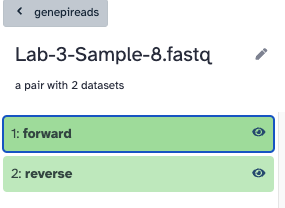

One of the things to help us understand what's in our data is to classify the reads using Kraken2. We can use Kraken2 to classify reads against a database of known sequences. This is a quick way to get an idea of what is in our data. We can then visualise the results in another tools like Krona or Pavian. 

Kraken 2 is a bioinformatics tool and software platform designed for the taxonomic classification of DNA sequences in metagenomic data. Metagenomics involves the study of genetic material collected from environmental samples, such as soil, water, or clinical specimens, to understand the microbial diversity present in these samples. Kraken 2 is a popular tool in this field, as it allows researchers to assign taxonomic labels to the sequences, helping them identify the microorganisms present in the samples.

For this exercise, we have three of the same samples that were processed in three different labs, for a total of nine samples. Usually, you know which organisms have been sent to you, but in this case I will let you figure that out from the data provided. 

:::Thanks
    Many thanks to Andrea Telatin and Thanh Le Viet, who provided these sequence data. 
:::

**Your tasks are:**

* Download/Upload the sequenced read data 
* Process them with Kraken2 
* View the Kraken2 report
* Visualise the result in Pavian and/or Krona 

:::Tip 
    Remember that there are three original isolates (Sample-1, Sample-3, Sample-8), that have been processed by three different groups (Lab-1, Lab-2, Lab-3); This means that we expect "Lab-1-Sample-1", "Lab-2-Sample-1", "Lab-3-Sample-1" to be the same.
:::

Then use this information to answer the following questions:

* **Which species were each sample supposed to be?**
* **Are there indications of contamination?** 
* **If there is contamination, what are the top three (in terms of abundance) other species identified?**
* **For each sample, how many reads were unclassified?**
* **Consider the typical genome size for each species, and calculate whether the samples have enough coverage for genome assembly**.
* **What are some possible sources of contamination (if any)? You can simply speculate.**

The rest of this page gives information on how to answer these questions. The [answers to these questions is here](/exercise-answers/read-class-answers).

:::Tip 
    We previous discussed the requirements regarding yield in ["A framework for QC"](/posts/qc-framework). In this case, we would like at least 20X coverage.
:::

## Help! I'm stuck
If you are having problems getting Kraken2 to run, [here are the report output files](files/Kraken2-Reports.zip). These files have enough information to answer the questions above. You use these files in Pavian as well.

There are some [krona plots available here](files/Krona_pie_chart_on_data_85,_data_84,_and_others__HTML_html.html).

## Running Kraken2 on these samples 
I will use [https://usegalaxy.eu/](https://usegalaxy.eu/) as an easy way to run Kraken2, and it will allow you to follow along. You may be able to do this on the command-line later using [some instructions here](/posts/qc-read-classification-cmd)

:::Note
    It's more important to understand the output, so if you are short on time; please skip to the following exercises exploring the results. 
:::

### Log in to Galaxy and upload the data 

Using the data linked above, upload the sequenced reads to Galaxy - be sure to create these in a List of Pairs collection. 

The collection should look like this, a list of nine pairs, and each pair has a forward and reverse. 

### Running Kraken2 

You should be able to find Kraken2 with the search bar on the left. The input should be Paired Collection and should be the collection of data you uploaded. 

The database I selected was "Preprint refseq indexes PlusPF". If you use a different database, you will get slightly different results. 

:::Warning
    Remember to "Print a report" under the Create a report dropdown 
:::

If this is all in order, click Run tool. It may take some time to run, so [here are the report output files](files/Kraken2-Reports.zip) I prepared earlier that you can use for the next step. 

## Exploring the results in the Kraken2 report

Open the Kraken reports you created in Galaxy, or [use the prepared reports here](files/Kraken2-Reports.zip). The report files are text files and should open in any text editor. It will look something like this,

There are six columns in each report file: 

* Percentage of fragments covered by the clade rooted at this taxon
* Number of fragments covered by the clade rooted at this taxon
* Number of fragments assigned directly to this taxon
* A rank code, indicating (U)nclassified, (R)oot, (D)omain, (K)ingdom, (P)hylum, (C)lass, (O)rder, (F)amily, (G)enus, or (S)pecies. Taxa that are not at any of these 10 ranks have a rank code that is formed by using the rank code of the closest ancestor rank with a number indicating the distance from that rank. E.g., "G2" is a rank code indicating a taxon is between genus and species and the grandparent taxon is at the genus rank.
* NCBI taxonomic ID number
* Indented scientific name

## Exploring the results with Pavian 

Pavian is available on a seperate website: [https://fbreitwieser.shinyapps.io/pavian/](https://fbreitwieser.shinyapps.io/pavian/). To use it, download the Kraken reports you created in Galaxy, or [use the prepared reports here](files/Kraken2-Reports.zip). Extact the report files from the zip file, and upload them into Pavian. 

## Exploring the results with Krona

There are two steps that take the Kraken2 report and create the visualisation with Krona. You must convert reports with the "Krakentools Convert kraken report file" as shown below. 

You must then use the output of this step in Krona, and set the input type to be Tabular.

The output will be an HTML file, with the results of all the samples; You can open this directly in Galaxy using the "eye".

**If you have difficulty running Krona, [here are the precalulated results](files/Krona_pie_chart_on_data_85,_data_84,_and_others__HTML_html.html)**

**This content was prepared as part of the GenEpi-BioTrain programme funded by ECDC. The GenEpi-BioTrain programme is an interdisciplinary course in genomic and epidemiology, which was held at Institut Pasteur between May 27th and June 7th, 2024.**

