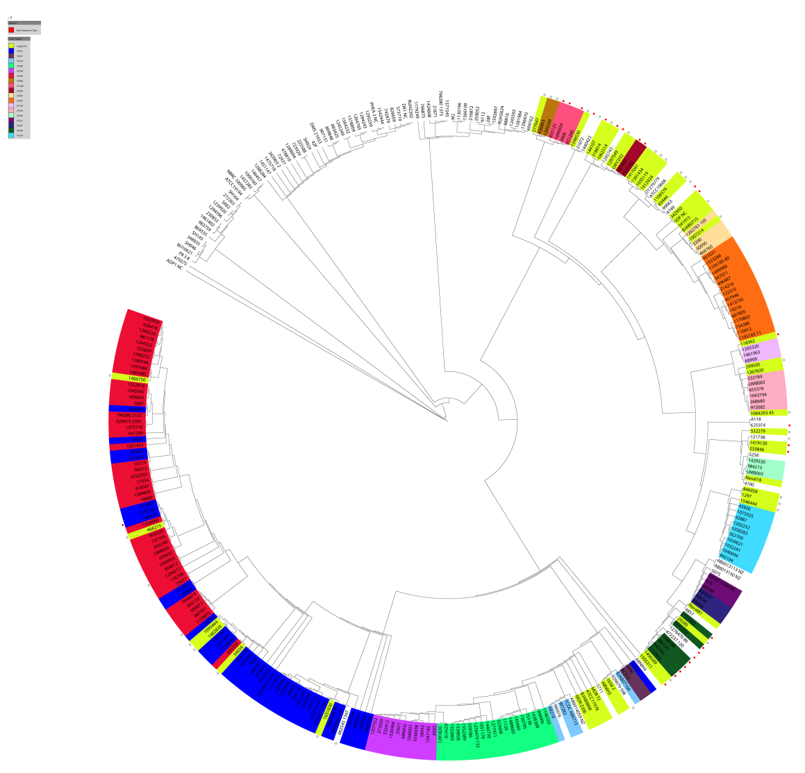
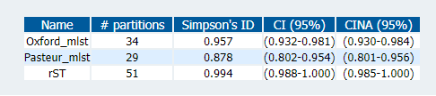
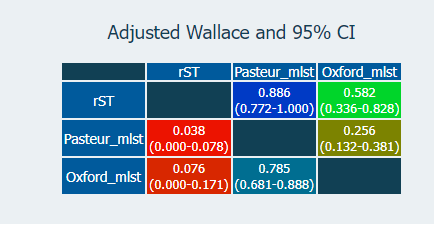
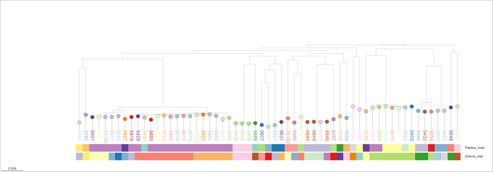

In the [previous post](/posts/support_for_rmlst), I describe rMLST ([Jolley et al. 2012](https://pubmed.ncbi.nlm.nih.gov/22282518/)) as a ready and able alternative for species without existing MLST schemes.

To recap:

> rMLST is a genotyping scheme that uses the genes for the bacterial ribosome protein subunits (_rps_ genes). This is as close as you can get to a universal MLST scheme. rMLST works on a diverse range
> of bacteria (like 16S) but provides deeper resolution beyond 16S in most species. See [Jolley et al. 2012](https://pubmed.ncbi.nlm.nih.gov/22282518/).

I should also mention here that rMLST is not readily available in MLST tools like [Torsten's mlst](https://github.com/tseemann/mlst), but it is accessible through an [API on the PubMLST website](https://pubmlst.org/bigsdb?db=pubmlst_rmlst_seqdef) for academic use.

I want to show how to run rMLST on a dataset, and assess that it works correctly. To do this, I revisited _Acinetobacter_ based on what we saw in the [previous post](/posts/support_for_rmlst).
It is known that the first _Acinetobacter_ MLST scheme (the 'Oxford' scheme) does not work very well. There has been a subsequent scheme (the 'Pasteur' scheme) published in [Diancourt et al. 2010](https://journals.plos.org/plosone/article?id=10.1371/journal.pone.0010034). This second scheme has been described to work better ([Gaiarsa et al. 2019](https://www.frontiersin.org/articles/10.3389/fmicb.2019.00930/full)). So I have
picked a fairly difficult example, but let's go through the motions and see how rMLST compares to both schemes, and core genome phylogenies.

# The dataset for our comparison

There is a dataset we can use described in:

> Wallace et al. (2016) "Use of comparative genomics to characterize the diversity of _Acinetobacter baumannii_ surveillance isolates in a health care institution". Antimicrob Agents Chemother; 60(10):5933-41. doi: [10.1128/AAC.00477-16.](https://journals.asm.org/doi/10.1128/AAC.00477-16)

I chose this one because it has accession codes for assembled contigs in the supplementary information - so I would not have to download sequenced reads and reassemble them. That sort of work would turn this into an actual project and I would rather keep this casual - just me doing random stuff in my pyjamas. In the supplementary materials of this publication, they show phylogenetic trees with MLST calls with the Oxford and Pasteur schemes and say the Pasteur scheme was more consistent with their tree. The figure showing the Oxford scheme is below:



> Supplemental Fig. 2. Oxford sequence types overlaid on the whole genome phylogeny
> presented in Figure 1. The isolates are colored by the sequence types (ST) defined by the
> MLST system. The diversity of colors indicates that there is little concordance between the
> whole genome phylogeny and the MLST sequence types.

You can see a strange mix of other STs (e.g. ST281 (blue) is intermingled with 'new' STs (red)) and other STs (light blue and dark green) are broken apart. Some genomes appear to be untypable (being blank).
There is room for improvement by using a revised scheme. Although, this might be a sign of a genus that cannot be resolved with MLST.

## Fetching the dataset

If you want to know how I fetch the genome assemblies and set up my working environment for this, I have a [separate post with all the details](/posts/supp-methods-for-rmlst-acineto)

# Calling rMLST using the pubMLST API

I can at least show you how to get easily retrieve rMLST called for your genome of interest using the pubMLST API. The API is free (and anonymous) to use. No registration required. It is described on the website as being free for academic non commercial use only. There are some example scripts of [how to use the API in curl, perl and python](https://pubmlst.org/species-id/species-identification-via-api). I expanded the python example script for our purposes. It takes a folder of assembled contigs (`ncbi_dataset/data`) and submits them one by one to the API. It then pulls out relevant fields from the returned JSON response and creates a table.

```python
#!/usr/bin/env python3
from os import mkdir, path, listdir
import shutil
import sys, requests, base64
from csv import DictWriter

def rmlst_taxon(fasta_file, name):
    uri = 'http://rest.pubmlst.org/db/pubmlst_rmlst_seqdef_kiosk/schemes/1/sequence'
    with open(fasta_file, 'r') as x:
        fasta = x.read()
    payload = '{"base64":true,"details":true,"sequence":"' + base64.b64encode(fasta.encode()).decode() + '"}'
    response = requests.post(uri, data=payload)
    if response.status_code == requests.codes.ok:
        data = response.json()
        try:
            taxon = []
            rST = data['fields']['rST']
            for match in data['taxon_prediction']:
                new_hit = {"name": name, "rST": rST, "rank":match['rank'], "taxon": match['taxon'], "support": str(match['support']), "taxonomy": match['taxonomy']}
                taxon.append(new_hit)
            return taxon, None
        except KeyError:
            return [{"name": name}], f"No match for {name}"

    else:
        return None, response.text


taxon_out = DictWriter(open('taxon.csv', 'w'), fieldnames=['name','rST', 'rank', 'taxon', 'support', 'taxonomy' ])
taxon_out.writeheader()
if not path.exists('gen_fasta'):
    mkdir('gen_fasta')
all_profiles = []
for fasta_path, name in [(path.join('ncbi_dataset/data',x), x) for x in listdir('ncbi_dataset/data') if x.startswith('GCA')]:
    fasta_file = [path.join(fasta_path, x) for x in listdir(fasta_path) if x.endswith('.fna')]
    if fasta_file:
        if not path.exists(f'gen_fasta/{name}.fasta'):
            shutil.copy(fasta_file[0], f'gen_fasta/{name}.fasta')
        print(f'Fetching rmlst for {name}...')
        taxon, errors  = rmlst_taxon(fasta_file[0], name)
        if taxon:
            print('Fetched rmlst')
            taxon_out.writerows(taxon)
        if errors:
            print(errors)
```

It is a quick and dirty script, but you can see there's nothing earth shattering here. The full specification of the API results [can be found here](https://pubmlst.org/species-id/species-identification-via-api).
This produces a table called [taxon.csv](/example_data/taxon.csv), and I have included a copy for you.

Using the same set of assembled contigs, I call regular MLST with [Torsten's mlst](https://github.com/tseemann/mlst).

```bash
mlst  gen_fasta/GCA_000162035.1.fasta --scheme abaumannii > mlst # Oxford scheme
mlst  gen_fasta/GCA_000162035.1.fasta --scheme abaumannii_2 > mlst_2 # Pasteur scheme
```

I merged the results from the two schemes, along with the rMLST results from before, into a single table [updated_st_table.csv](/example_data/updated_st_table.csv) so we can compared all the schemes together.
We can measure the concordance and diversity of the schemes with statistical tests available on the [Comparing Partitions website](http://www.comparingpartitions.info/index.php?link=Tool).





The diversity index echoes what people have described before; that the Pasteur scheme has fewer STs than the Oxford one. rMLST, however, has more partitions than both. The measure of concordance (Adj. Wallace; above), shows that rMLST is more consistent with the Pasteur scheme (the 'right' one), although those overlapping confidence intervals may mean that this is not significant.

This is not definitive. Let's have a closer look at one species, _A. baumannii_, to understand this better. I separate the _A. baumannii_ genomes into their own folder, and run `parsnp` to generate a core genome alignment and phylogeny.

```bash
parsnp  -p 8   -r !  -d ./baumannii/ -c
```

I then visualize the tree in Microreact and annotate with the sequence types from the three schemes.



Ah. OK. This does not look that good either. There are inconsistencies between Pasteur and Oxford as previously described. The rMLST designations are mostly OK - like the Pasteur scheme - and do not conflict with the tree topology outright. But, there are examples (e.g. rST 8849 and 9510) appear split across clades. This is bad. If you want to explore the tree further, I have saved an interactive version of the tree at https://microreact.org/project/baumannii-rmlst

Not a conclusive result overall. It is now time to ask an expert why three different schemes can't get it perfect - it is ok to ask for help, kids! Alternatively, it could be the way I've generated the phylogeny that is causing problems.

Great. Looks like I've set myself up for a sequel and there _are_ some other existing datasets to play with, including

- [Roberts et al. 2022](<https://www.thelancet.com/journals/lanmic/article/PIIS2666-5247(22)00181-1/fulltext>)
- [Diancourt et al. 2010](https://journals.plos.org/plosone/article?id=10.1371/journal.pone.0010034)

Regardless of our mixed results, the process I've described here is something you can apply to any other genus.
