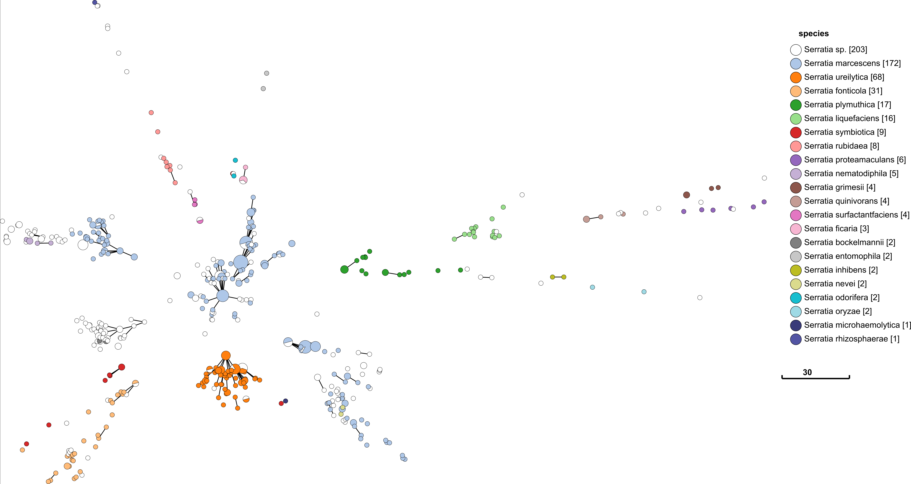
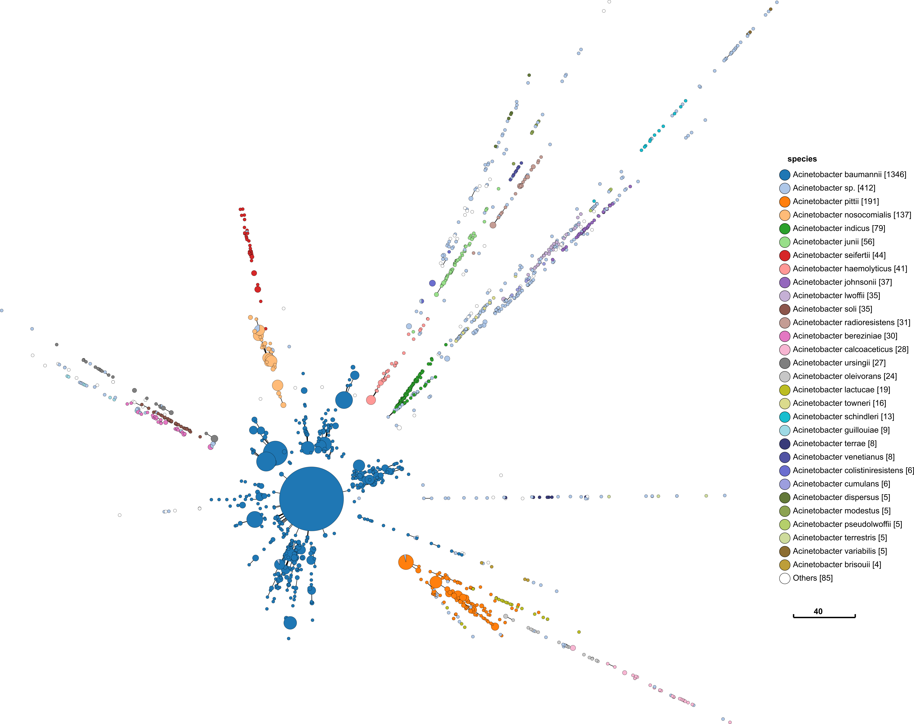
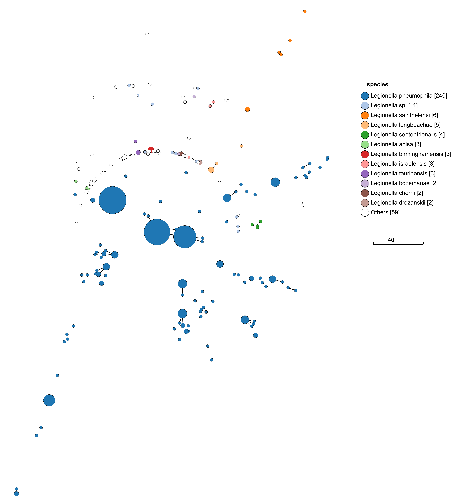

There is a [follow up post](/posts/rmlst-in-acinetobacter) where I dive into the usage of rMLST and apply it futher to _Acinetobacter_.

I am a big fan of ribosomal MLST (rMLST) from [Jolley et al. 2012](https://pubmed.ncbi.nlm.nih.gov/22282518/). We used it extensively in calibrating cgMLST for _Salmonella_ and my then colleague, Zhemin Zhou, used it for designing subsequent EnteroBase cgMLST schemes.

rMLST is a genotyping scheme that uses the genes for the bacterial ribosome protein subunits (_rps_ genes). This is as close as you can get to a universal MLST scheme.
rMLST works on a diverse range of bacteria (like 16S) but provides deeper resolution beyond 16S in most species. See Figure 1 & 2 in [Jolley et al. 2012](https://pubmed.ncbi.nlm.nih.gov/22282518/).

In _Salmonella_, rMLST was consistent with MLST. We performed a head to head comparison of eBGs (_Salmonella_ eBurst groups based on 7 gene MLST) with reBGs (_Salmonella_ eBurst groups based on rMLST)
and found the clustering from both methods consistent (Adj. Rand; 0.992). There were only six cluster groups that had major conflicts - which, on closer inspection, seemed to be consisted of
genomes affected by homologous recombination ([Alikhan et al. 2018](https://journals.plos.org/plosgenetics/article?id=10.1371/journal.pgen.1007261)).

By the way,

> eBG (eBurst group) is a group of related STs based on single-linkage clustering, in which the distance between nodes is only one allele.
> EnteroBase automatically adds new related STs to the most similar eBG unless they are one or two alleles distant from a second eBG.

eBGs are a simple way of describing natural genetic populations for many bacterial species (including _Salmonella_, which you can read about in [Achtman et al. 2012](https://journals.plos.org/plospathogens/article?id=10.1371/journal.ppat.1002776))

In every subsequent comparison I have done, rMLST cluster groups have been mostly consistent with core genome SNP phlyogenies. I find rMLST an incredibly useful starting point for exploring a species (or even an entire genus).

At a recent meeting (IMMEM13), I met many people who were looking to apply different approaches to capture population structure for species without MLST (or defective MLST) schemes. Some wanted to use
cgMLST or other complicated methods. I told them they could use any of those methods, but it was perhaps excessive for their purposes. Constructing and validating a cgMLST scheme can be a labourious process.
Although, when I finally suggested rMLST as a ready and able alternative, I was met with blank faces.

I have already described my case for why rMLST is a sensible approach, but I thought I would demonstrate rMLST on three genera without MLST (or with a defective MLST) schemes. These were genera mentioned to me at IMMEM and
include _Legionella_, _Acinetobacter_ and _Serratia_. I may embarrass myself in the process, as I have not worked with these particular genera before. _Acinetobacter_ has two MLST schemes, by the way, and only one of them has major issues as shown in [Gaiarsa et al. 2019](https://www.frontiersin.org/articles/10.3389/fmicb.2019.00930/full).

I should also mention here that rMLST database is not readily available in MLST tools like [Torsten's mlst](https://github.com/tseemann/mlst), but it is accessible through the [PubMLST website](https://pubmlst.org/bigsdb?db=pubmlst_rmlst_seqdef) for academic non commercial use only. It requires (free) registration and you need to
request access for the rMLST database specifically, but the process is fast and painless.

Above is a minimum spanning tree (GrapeTree) of rMLST profiles for the genus _Serratia_. Each node represents an 'rEBG'; which is single-linkage clustering applied to rMLST STs. Nodes are collapsed when distance between profiles is two or less alleles. Edges between nodes are shown if the distance is less than 5 alleles.
Nodes are colour coded with species assignments provided by rMLST. Profiles here are a subset of all rMLST profiles available on [PubMLST](https://pubmlst.org/bigsdb?db=pubmlst_rmlst_seqdef). The tree was calculated using MSTree.py from [GrapeTree](https://github.com/achtman-lab/GrapeTree).

Species definition is defined by rMLST in this case, so the fact that it corresponds so well with rMLST is not that impressive. What is important is that there are a good number of rSTs defined in each species e.g. 172 in _S. marcessens_.
There is nothing worse than a genotyping scheme that simply lumps everything in a single sequence type. The fact that each species is clearly seperated is also a good indication that rMLST will be consistent with a robust phylogenetic
analysis. It is curious that _S. marcessens_ is split into at least three sub groups, but this is something for a _Serratia_ expert to comment on.

I repeat the same approach with _Acinetobacter_ below. The process and visualisation is exactly the same.

This has similar promising signs as _Serratia_. Perhaps more so, since it looks similar to what I would find in _Salmonella_.

Finally, let us look at _Legionella_. The process and visualisation is exactly the same.

Ah! Now I am out of my depth. This is something I can not interpret. It is odd that the species _L. pneumophila_ is so disperse. I cannot say what this means. A _Legionella_ expert might know.

The figures above (at least the first two) are good suggestions that rMLST would be a ready and able genotyping scheme for these genera. To demonstrate this definitively, we would need to:

- Work with an expert for each of the genera. We need help assessing whether this makes sense.
- Take a representative set of genomes from each genus.
- Construct a core genome SNP phylogeny (and assume this as a gold standard).
- Compare tree topology with groupings from rMLST STs.

None of that is really that hard. **Would you like to get invovled?**

There is a [follow up post](/posts/rmlst-in-acinetobacter) where I dive into the usage of rMLST and apply it futher to _Acinetobacter_.
