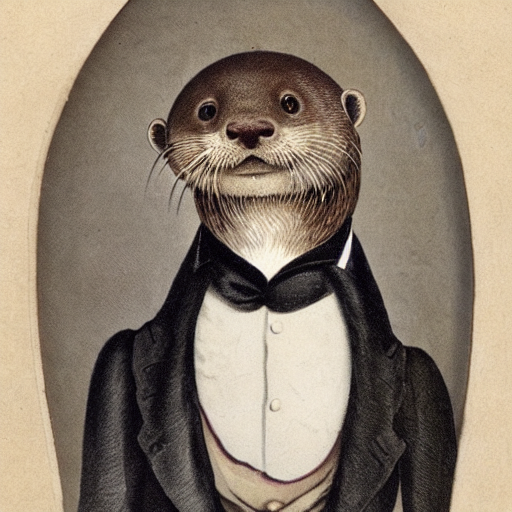
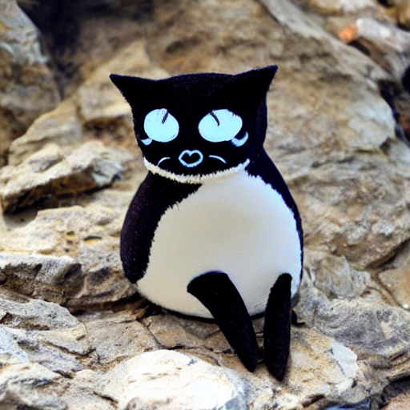
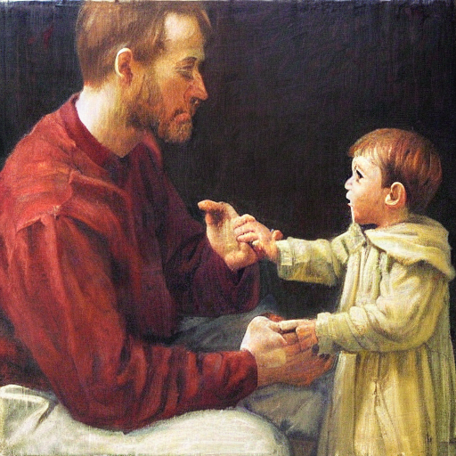
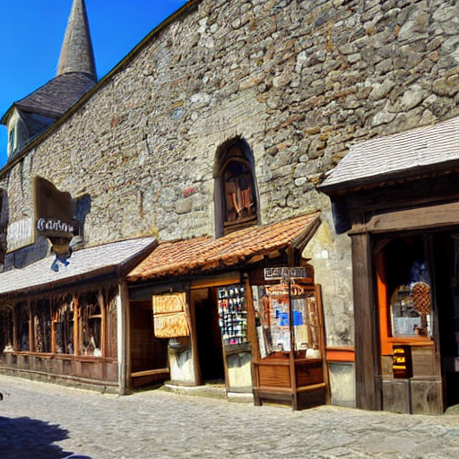

[Stability.ai](https://stability.ai) has just publicly released an open source text to image AI that you can download and run on your local consumer GPU. From the [github](https://github.com/CompVis/stable-diffusion):

> Stable Diffusion is a latent text-to-image diffusion model.

I have no idea what this means. All I know is that you give it some words and it tries to generate an image encorporating those words. This particular technology is limited. It can not render readable text. It cannot achieve true photorealism. It can not do a lot of things. It can, however, produce images that at a glance look suprisingly legitimate.

The [full annoucement is here](https://stability.ai/blog/stable-diffusion-public-release)

# How do I get access to this?

**You first need an account on [huggingface.co](https://huggingface.co/)**. Sign up is free, but you do need to verify your email. In this account, you need to mint a user access token, which you can do from this page [https://huggingface.co/settings/tokens](https://huggingface.co/settings/tokens). You will use this token later to download the AI models.

If you can get to this point yourself, you're golden.


**The software itself is all available as Python modules.** You need to install the following:

```bash
pip install diffusers transformers scipy
```

**You need to login into huggingface on the command-line**. It will prompt for the token that you just created on the website.

```bash
huggingface-cli login
```

**You can then generate images in python scripts by calling the `StableDiffusionPipeline` from `diffusers`.** In the sample script below, you can see the steps: download the model, switch to using the GPU, then feed in the prompts, and write the output image.

```python
import torch
from diffusers import StableDiffusionPipeline
from PIL import Image
from torch import autocast

prompts = ["a gentleman otter in a 19th century portrait",
    "Cat penguin",
    "father speaking to son Fine Art"]


# make sure you're logged in with `huggingface-cli login`
pipe = StableDiffusionPipeline.from_pretrained("CompVis/stable-diffusion-v1-4",
     use_auth_token=True)

print('Loaded model')
pipe = pipe.to("cuda")
generator = torch.Generator("cuda").manual_seed(200)

print('running...')
with autocast("cuda"):
    for prompt in prompts:
      prompt = prompt.strip()
      image = pipe(prompt, num_inference_steps=100, generator=generator )["sample"][0]
      prompt_filename = (prompt[:30] + '..') if len(prompt) > 30 else prompt
      output = prompt_filename.replace(' ', '_').replace(',', '') + ".png"
      print(f'Saving image: {prompt} to {output}')
      image.save(output)
```

**Some things to note:**

- The `StableDiffusionPipeline.from_pretrained` will download the required models
  at runtime. This will take up ~5GB.
- You need to setup the authenication token at [huggingface.co](https://huggingface.co/).
- You could also feed the token in directly with `pipe = StableDiffusionPipeline.from_pretrained("CompVis/stable-diffusion-v1-4", use_auth_token=YOUR_TOKEN)`, rather than giving a boolean as I have done. This would allow you to skip the `huggingface-cli` step above.
- `torch.Generator("cuda").manual_seed(200)` allows you to choose the random seed.
- `num_inference_steps` is the number of iterations, the higher the more detail will be added to the resulting picture. This increases the runtime, and it does not mean that the picture will be better. If not specified it will run with the default value of `51`. The maximum number of iterations depends on the amount of GPU memory available.

I had a lot of help from this [Google Collab notebook](https://colab.research.google.com/github/huggingface/notebooks/blob/main/diffusers/stable_diffusion.ipynb), which explains more advanced topics like showing images on a grid and creating your own diffusers.

# Some of the glorious output



**prompt: a gentleman otter in a 19th century portrait**



**prompt: Cat penguin**



**prompt: father speaking to son, Fine Art**


**prompt: an ornate lighthouse rising from the sea**



**prompt: medieval shops and towns**
