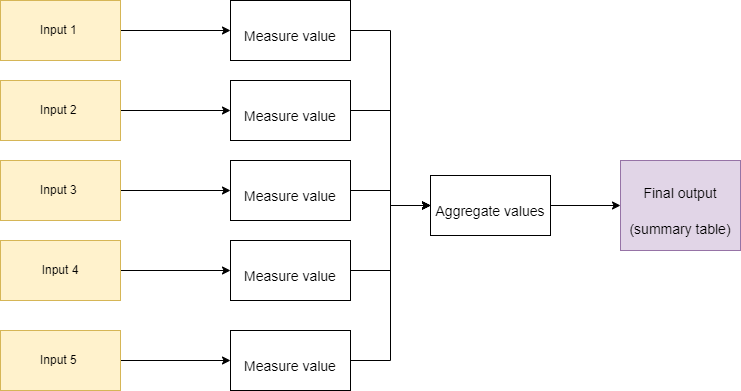
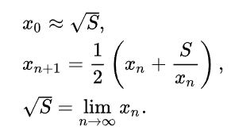

Continuing from last time, [what is bioinformatics](/posts/what-is-bioinformatics), we are discussing which topics we need to know to understand bioinformatics. As per our definition,

> Bioinformatics is the storage, manipulation, and presentation of data about biological systems until it becomes information.

So, it is a process of transforming one thing into another. **Input > Transformation > Output**. It is unlikely that the desired output will come from one round of transformation. For example, say we had a set of five input samples, from which we want to take some measurement of each sample and then produce a final summary. We would do:



There are two things to note here. First, the "measure value" step should be agnostic to each input (input 1-5). It should take any input (given some assumptions) and measure the value. Second, "Aggregate values" does not operate on the raw input, but takes the output from each of the "measure value" steps and performs the required transformation. This seems simple, doesn't it? But many forget that this is all that ever happens, regardless of how complex the process seems to be. Our computation is never more than transforming input (with assumptions) into a desired output.

## Initial inputs

In bioinformatics, what counts as an initial input? The initial input can come from a range of source instruments. Every instrument has a bias and will introduce artefacts into its measurements. It is important to know these and how they affect your downstream analysis. This does not mean, however, that you need to know the instruments intimately, such that you could build one yourself. For me, I focus on microbial genomes (DNA/RNA). So understanding the machines and mechanisms that produce these types of data are important. These methods have been developed out of the molecular biology so it is helpful to know a little about that field too.  
Initial inputs can be drawn from other molecules (e.g. proteins/amino acids). Each of those in turn have different instruments. For others, spectroscopy or microscopy are the basis of their input data. In the end, regardless of the source, every instrument has a bias and will introduce artefacts into its measurements.

## Outputs

The intermediate outputs result from the input being transfomed. It is hopefully in line with what was expected. The ultimate output should be an answer to the original reason the data is being produced and analysed.

## The transformation process

Describing the transformation process is a difficult. It is not immediately intuitive and required understanding topics in computer science of which many are not familiar. My description of the _transformation_ may have reminded you of algorithms, which I mentioned previously with no explanation. Here is my definition:

> An algorithm is a set of well-defined instructions, which, if followed, will consistently solve a particular problem. This problem is usually a mathematical one.

Deeply understanding mathematics is not a strict requirement for being able to do the computation in bioinformatics. Although, the example I want to show you is mathematical. Let's dissect a straight forward example of this transformation process.

The problem is to calculate the square root of a given number. This solution is an excellent example of computation and was first recorded by [Heron of Alexandria almost 2,000 years ago](https://en.wikipedia.org/wiki/Methods_of_computing_square_roots#Babylonian_method). This raises an important point. The process of computation is much older than our modern electronic computers. Today, computation on a computer has two parts; first, solving the computation problem itself, and second giving the correct instructions to a computer. Let us concentrate on the first part.

Again, the problem is to calculate the square root of a given number. The solution, in plain language, is:

### How to calculate a square root of number S

- We assume the number (S) is a positive number.
- We guess a number (x) that we think is the square root (I usually just half the number S )
- We divide our original value by this guess (S / x)
- We add the guess to this fraction ( x + (S / x) )
- We divide the total by 2. ( ( x + (S / x ) ) / 2 )
- This value is our new guess, we can compare it to our old guess to see how much it has changed.
- If there is a drastic change, we repeat the procedure using the new guess instead. If the change is negligible, we have more or less converged on the true number and we stop.
- In theory, the more times we repeat this process, the closer we will reach the true value.

The mathematics wizards will write this procedure as:



In the programming language (Python), it could be written as:

```python
def sqrt_heron(s, margin_of_error):
    previous_guess = 1.0
    current_guess =  0.5 * (1 + s)
    while abs(current_guess - previous_guess) > margin_of_error:
        previous_guess = current_guess
        current_guess = 0.5 * (current_guess + s / current_guess)
    return current_guess
# if the change between the previous guess and the current
# guess is lower than the specified margin of error then
# the program halts and returns the best guess. I had
# mentioned this criterion in the written steps above.
```

I followed these steps by hand to calculate the square root of 80. My first guess was that the square root of 80 was 40. A calculator will tell you that the square root of 80 is 8.94427191. Let's see how the method fairs.

```maths
1. ((80 / 40) + 40) / 2  = 21
2. ((80 / 21) + 21) / 2  = 12.4
3. ((80 / 12.4) + 12.4) / 2  = 9.4
4. ((80 / 9.4) + 9.4) / 2  = 8.95
5. ((80 / 8.95) + 8.95) / 2  = 8.94
```

After five iterations, with some lazy rounding at each step, we have 8.94 as our best guess. The calculator's value is 8.94427191. That's a great result. Something that we computed by hand.

The key messages from this example are:

- Computation (algorithms) is about developing well-defined instructions to solve a problem and does not strictly mean working with a modern electronic computer.
- The square root method here takes an input value, transforms it, and produces a desired output. Bioinformatics is a series of such transformations.
- The method has assumptions about the input. For instance, negative numbers will not work. Inputs that are not a number will not work, e.g. What is the square root of the word "eggplant"?

The square root example was to show the process of **input > transformation > output**. Most bioinformaticians, and computer users in general, do not actually write this procedure out themselves. What we do is we look for an existing solution that has the desired output, and will accept our input. We do not actually care how the calculation is done. So perhaps, if we are directly using someone else's square root method that they later change to be faster somehow. As long as the name of the method that we call and the inputs do not change, we would never know.

We only need to assess the Inputs, assumptions around those inputs, and the Outputs. So more accurate use of the square root method would look like this:

```python
def square_root(input_value):
# Input: A number we wish to find the square root
# Assumptions: input will be a number, the number will be positive.
# Output: The square root of input, as a decimal number.
#
# I actually do not know, nor care, what happens in here.
#

# I just call the method above
square_root(9)
3

square_root(36)
6
```

If I was only interested in the square root of 9 and 36. I could use the program we wrote above or I could use a very flawed version like this one.

```python
def square_root(input_value):
	if input_value == 9:
		return 3
	if input_value == 36:
		return 6
	return None

square_root(9)
3

square_root(36)
6
```

We would argue that the second version is worst because it makes more assumptions about the input. The input for the second version can only be integers 9 and 36. Whereas for the first, applies to any positive number. However, if our input can only ever be 9 or 36, then this second implementation is perfectly suitable.

Concentrating on relevant aspects, such as Input and Output, and ignoring others, such as the specifics of how it is calculated, refers to a fundamental aspect of computer science, called [Abstraction](<https://en.wikipedia.org/wiki/Abstraction_(computer_science)>). Abstraction in computer science is such a critical topic, [I have written a specific section about it](/posts/abstraction-in-computer-science). There is a process of describing methods such that a person can use them without fully understanding what they are doing internally. The description will include, as a minimum, much of what we have already discussed.

- Input(s)
- Assumptions about the input(s)
- The layout of the output(s)
  It may also include an explanation of how long the method will take.

Where there is no such formal specification, a bioinformatician (or computer user generally) will need to take data where the input and corresponding output is known and run this through a method they wish to use. The method should give the expected results for all the test data to be acceptable. If no method can be found, then it may be required to actually program their own solution. It is only at this stage in bioinformatics that knowing how to program well becomes a strict requirement.

In the next section, I will refer all this back to microbial genomics and explain that in detail.
